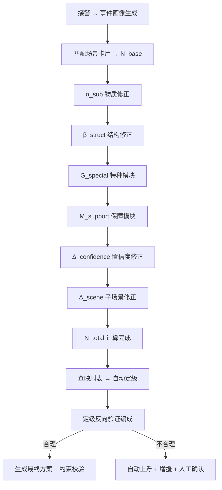

# 调派规模计算模型（N_total）——扩展版

**最后更新**：2026-04-23
**标签**：#N_total #调派规模 #数据定力 #按出动力度定级 #公式扩展 #子场景驱动
**适用版本**：接处警 7.0 系统调派引擎

## 1. 概述（扩展目标）

本模型是调派引擎的**核心大脑**，以**事件画像**为唯一输入，精准计算本次警情所需的最小作战单元数量（N_total，以"车"为单位）。
**扩展核心**：
- 支持 10 大子场景（覆盖 95%+ 火警）
- 引入**动态系数**与**置信度加权**
- 支持**子场景预设 + 画像修正**双驱动
- 实现**正向计算 + 定级反向验证**闭环
- 完全可配置、可审计、可本地化

## 2. 扩展后完整公式

$$
N_{\text{total}} = N_{\text{base}} + \alpha_{\text{sub}} + \beta_{\text{struct}} + G_{\text{special}} + M_{\text{support}} + \Delta_{\text{confidence}} + \Delta_{\text{scene}}
$$

**新增项说明**：
- **Δ_confidence**：置信度修正（低置信度时自动上浮）
- **Δ_scene**：子场景专用修正系数（更精细）

## 3. 各分项详细扩展说明

| 分项              | 含义                     | 计算依据                          | 扩展系数示例                          | 权重 |
|-------------------|--------------------------|-----------------------------------|---------------------------------------|------|
| **N_base**        | 基础力量                 | 子场景卡片默认值                  | 普通住宅=2、高层=4、化工=5            | 基础 |
| **α_sub**         | 物质修正                 | 能量物质类型 + 荷载               | 锂电池 +2～+3、易燃液体>10t +3       | 最高 |
| **β_struct**      | 结构修正                 | 建筑高度 + 结构类型               | 高层每30m +1、地下/大跨度 +2         | 高   |
| **G_special**     | 特种模块                 | 特殊画像触发                      | 防化+1、机器人+1、医疗+1              | 中   |
| **M_support**     | 保障模块                 | 发展阶段 + 预计作战时长           | 猛烈/长时 +2（向上取整）              | 低   |
| **Δ_confidence**  | 置信度修正               | 核心槽位平均置信度                | 置信度<75% 时 +1～+2                  | 动态 |
| **Δ_scene**       | 子场景专用修正           | 10 大子场景预设                   | 锂电池仓库额外 +1（复燃风险）         | 动态 |

## 4. 与 10 大子场景的映射（扩展核心）

| 序号 | 子场景名称             | N_base | α_sub | β_struct | G_special | M_support | Δ_scene | **N_total 范围** | 映射等级 |
|------|------------------------|--------|-------|----------|-----------|-----------|---------|------------------|----------|
| 1    | 普通住宅火灾           | 2      | 0     | 0        | 0         | 0         | 0       | 2-4              | 一级     |
| 2    | 高层住宅火灾           | 4      | +2    | +2       | 0         | +1        | +1      | 8-12             | 三级     |
| 3    | 地下车库火灾           | 3      | +1    | +2       | +1        | +1        | +1      | 7-10             | 二~三级  |
| 4    | 商业综合体火灾         | 4      | +1    | +1       | +2        | +1        | +1      | 9-13             | 三级     |
| 5    | 工业厂房/仓库火灾      | 4      | +1    | +2       | +1        | +1        | +1      | 8-14             | 三~四级  |
| 6    | 化工/危化品园区火灾    | 5      | +3    | +2       | +2        | +2        | +2      | 13-20            | 四级     |
| 7    | 锂电池集中仓库火灾     | 4      | +3    | +1       | +1        | +2        | +2      | 10-15            | 三~四级  |
| 8    | 电动车/新能源汽车火灾 | 3      | +2    | 0        | 0         | +1        | +1      | 4-8              | 二级     |
| 9    | 人员密集公共场所火灾   | 4      | +1    | +1       | +2        | +1        | +2      | 10-16            | 三~四级  |
| 10   | 大型物流/冷库火灾      | 4      | +1    | +2       | +1        | +1        | +1      | 9-14             | 三级     |

## 5. 置信度修正规则（Δ_confidence）

- 核心槽位平均置信度 < 75% → +1～+2
- 被困人数或能量物质置信度 < 80% → 强制触发人工确认

## 6. 定级映射规则

N_total 计算完成后，系统立即反向映射生成警情等级：

| N_total 范围 | 警情等级 | 典型N_total | 对应描述 | 典型场景示例 | 联动级别 | 自动升级阈值 |
|---|---|---|---|---|---|---|
| 1～4 车 | **一级警** | 2～4 | 一般火灾/小型救援 | 普通住宅火灾 | 辖区内快速响应 | 实际可用车<2或火势发展 |
| 5～8 车 | **二级警** | 5～8 | 中等规模火灾/初期复杂救援 | 地下车库初期、中型厂房 | 支队增援 | 实际可用车<5或现场反馈扩大 |
| 9～12 车 | **三级警** | 9～12 | 较大火灾/复杂建筑救援 | 高层85m火灾、锂电池仓库、地下车库 | 跨区调派+特种 | 实际可用车<8或被困人数显著增加 |
| 13～18 车 | **四级警** | 13～18 | 重大火灾/危化品救援 | 化工园区火灾 | 全市联动+专家组 | 实际可用车<12或多警情并发 |
| 19车及以上 | **五级警** | 19+ | 特别重大/大规模灾害 | 大面积化工泄漏+多人被困 | 全省/跨省联动+国家支援 | 实际可用车<18或火势失控 |

## 7. 配置方式（后台规则表）

支持 JSON 配置示例：
```json
{
  "scene": "highrise",
  "base": 4,
  "alpha_sub": {"lithium": 2, "default": 0},
  "beta_struct": {"height_per_30m": 1}
}
```

## 8. 计算流程（全链路）



## 9. 扩展功能（未来方向）

- **AI 预测模块**：接入历史数据预测作战时长 → 动态调整 M_support
- **IoT 实时修正**：烟感、热成像数据直接修改 Δ_scene
- **全局资源约束**：多警情并发时自动下调非关键子场景的 N_total
- **本地化支持**：各支队可独立维护自己的子场景系数表

## 10. 快速参考表

| 场景类型 | N_base | α_sub | β_struct | G_special | M_support | **N_total** | 定级 |
|---|---|---|---|---|---|---|---|
| 普通住宅火灾 | 2 | 0 | 0 | 0 | 0 | 2-4 | 一级 |
| 高层85m+锂电池 | 4 | +2 | +2 | 0 | +1 | 9 | 三级 |
| 化工园区 | 5 | +3 | +2 | +2 | +2 | 14 | 四/五级 |
| 地下车库 | 3 | +1 | +2 | +1 | +1 | 8 | 二级 |
| 大跨度厂房 | 4 | +1 | +2 | +1 | +1 | 9 | 三级 |
| 人员密集商场 | 4 | +1 | +1 | +2 | +1 | 9 | 三级 |
| 锂电池仓库 | 4 | +3 | +1 | +1 | +2 | 11 | 三级 |
| 危化品泄漏救援 | 3 | +3 | 0 | +3 | +1 | 10 | 三级 |

## 11. 相关链接

- [[火灾子场景分类]]
- [[10大子场景详细计算示例]]
- [[警情定级映射规则]]
- [[定级反向验证逻辑详解]]
- [[03_调派引擎/MOC-调派引擎]]

## 12. 变更记录

- 2026-04-23：**扩展版**发布，新增 Δ_confidence、Δ_scene、10 大子场景映射表、JSON 配置示例
- 2026-01：基础公式确立