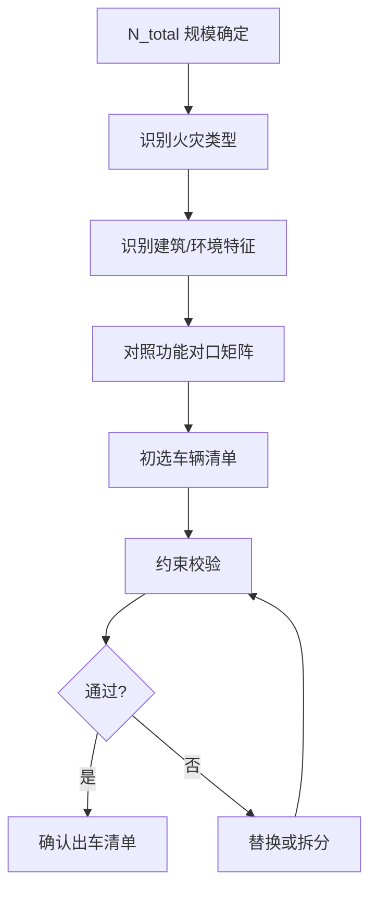

# 车辆确定逻辑（功能对口 + 约束校验）

## 核心原则

每辆被调派车辆必须有**明确的战术用途**，功能对口是车辆选型的首要原则。

## 功能对口矩阵

| 火灾类型 | 必配车型 | 可选车型 | 禁用车类型 |
|---|---|---|---|
| 普通建筑火灾 | 水罐车×N | 举高车、抢险车 | — |
| 高层建筑 | 举高车、供水车 | 水罐车（内攻）、救护车 | 小型车（供水不足）|
| 地下/大跨度 | 排烟车、破拆车 | 水罐车（供水）| 举高车（无法伸展）|
| 化工火灾 | 泡沫车、防化车 | 洗消车、供水车 | 水罐车（无抗溶泡沫）|
| 城中村狭窄巷道 | 小型水罐车 | 摩托车（侦查）| 重型水罐车（无法通行）|

## 车辆选型决策流程



## 约束校验（车辆层面）

详见[[04_约束校验机制]]，车辆级约束包括：

### 人员约束

- 驾驶员在位率 ≥ 70%
- 特种操作员（举高、吊装）必须持证在位

### 道路约束

- 限高：举高车需净空高度满足
- 限重：重型水罐车/泡沫车需道路承重满足
- 施工封路：实时绕行规划

### 空防约束

- 在位率 ≥ 50-60%，防止调空辖区
- 本部保留最低战力

## 典型配置示例

### 普通住宅火灾（N_total=2）

```
主管站: 水罐车×2
└─ 无需补齐
```

### 高层85m化工火灾（N_total=12）^[inferred]

```
主管中心站: 举高车×2 + 泡沫车×2 + 供水车×1
跨区补齐:   防化车×1 + 排烟车×1 + 救护车×1
保障模块:   照明车×1 + 通信车×1 + AED×1
增援预备:   水罐车×2
```

## 相关链接

- [[队站确定逻辑]] — 车辆所属队站的确定
- [[调派规模计算模型]] — 功能对口如何映射到N_total
- [[03_调派引擎/04_约束校验机制]] — 校验失败时的替换逻辑
