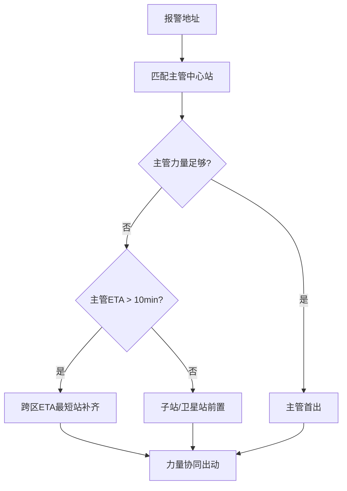

# 队站确定逻辑（主管锚定 + ETA 补齐）

## 核心原则

放弃单一辖区模式，采用**主管锚定（熟悉度优先） + 时空最优（ETA 优先） + 子站耦合**的复合规则。

## 三层确定逻辑

### 第一层：主管队站锚定（Command Anchor）

**目的**：利用辖区熟悉度，优先派遣最了解现场的单位

- 根据报警地址精准匹配**主管中心站**
- 强制出动：**1 指挥单元 + 1-2 台主战车**
- 熟悉度优势：
  - 水源分布（消防栓、天然水源）
  - 重点单位（医院、学校、危化企业）
  - 建筑结构（高层、地下、大型商业）

### 第二层：最近队站 ETA 补齐（Time-Critical Support）

**目的**：当主管力量不足或响应时间过长时，快速补齐战斗力

- 实时 ETA 计算：

$$
\text{ETA} = \frac{\text{距离}}{\text{平均车速} \times \text{拥堵系数}}
$$

- **触发阈值**：主管站 ETA > 10 分钟 **或** 力量不足
- 优先级顺序：

```
主管站 → ETA 最短跨区站 → 卫星/子站
```

### 第三层：子站/卫星站梯次前置

**目的**：形成协同作战梯队，减少到场时间

- 子站作为前置力量提前出动
- 与主管站形成"先头+主力"配置
- 特殊情况：高层/地下由专业站（如特勤站）主管

## 决策流程图



## 特殊情况处理

| 场景 | 主管站规则调整 |
|---|---|
| 化工园区 | 化工专业站主管，非辖区中心站 |
| 高层建筑 >100m | 举高专业站主管 |
| 跨区域边界 | 双方协商，指挥中心指定 |
| 多点起火 | 按优先级排序，轮流调派 |

## 相关链接

- [[调派规模计算模型]] — 队站确定后如何计算规模
- [[03_调派引擎/04_约束校验机制]] — 队站确定后需通过的校验
- [[02_业务模型/03_定级与编成机制]] — 队站与编成的关联
