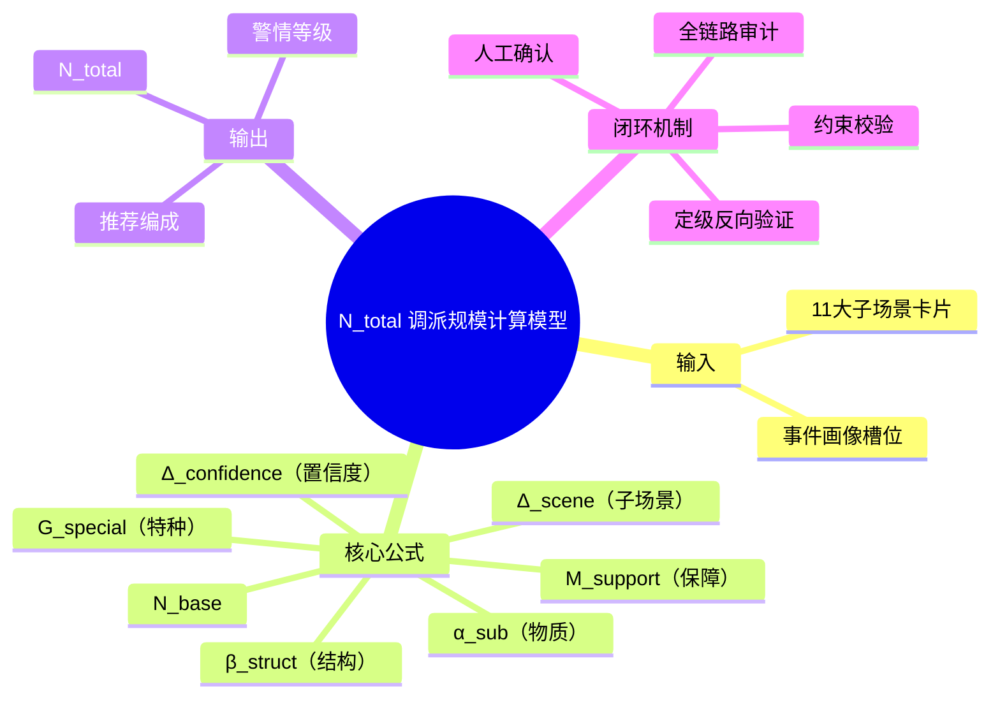

# MOC-调派规模计算模型

**最后更新**：2026-04-24
**标签**：#MOC #N_total #调派规模 #核心模型 #数据定力
**页面作用**：**调派规模计算模型的单一入口**，所有相关知识在此汇聚，是产品，开发、接警员、指挥员的**第一站**。

## 英雄区 · 一键快速入口

> **[!important] 接警 / 指挥最常用**
> - [[火灾子场景分类]] —— 快速匹配子场景
> - [[所有子场景推荐编成统一对照表]] —— 直接看该派什么力量
> - [[子场景画像/]] —— 查看完整画像与计算过程

> **[!note] 产品 / 开发最常用**
> - [[调派规模计算模型]] —— 公式与配置详解
> - [[03_调派引擎/警情定级映射规则]] —— N_total 如何转等级
> - [[03_调派引擎/定级反向验证逻辑详解]] —— 闭环机制核心

---

## 模型总览

**调派规模计算模型（N_total）** 是接处警 7.0 系统调派引擎的**核心大脑**。
它以**事件画像 + 11大子场景**为输入，精准计算作战单元数量，实现"**按出动力度定级**"。

**核心公式**：
$$
N_{\text{total}} = N_{\text{base}} + \alpha_{\text{sub}} + \beta_{\text{struct}} + G_{\text{special}} + M_{\text{support}} + \Delta_{\text{confidence}} + \Delta_{\text{scene}}
$$

**覆盖范围**：10大火灾子场景 + 1个洪水救援子场景，覆盖 **95%+** 日常火警及常见应急救援。

---

## 模型全景思维导图

---

## 核心内容导航（按角色分组）

### 接警员 / 指挥员专区
- [[火灾子场景分类]]（快速匹配）
- [[所有子场景推荐编成统一对照表]]（实战编成速查）
- [[子场景画像/]]（完整画像 + 计算示例）

### 产品 / 开发专区
- [[调派规模计算模型]]（公式 + JSON 配置）
- [[03_调派引擎/警情定级映射规则]]
- [[03_调派引擎/定级反向验证逻辑详解]]
- [[03_调派引擎/约束校验实现细节]]
- [[03_调派引擎/05_人工确认与责任机制]]

### 数据模型支撑
- [[04_数据模型/01_核心实体与领域模型]]
- [[04_数据模型/05_调派规则模型]]

---

## 11大子场景推荐编成速查表

| 子场景 | N_total | 等级 | 首波主力 | 保障 | 增援 |
|--------|---------|------|----------|------|------|
| 普通住宅 | 2-4 | 一级 | 2水罐 | - | 指挥车可选 |
| 高层住宅 | 8-12 | 三级 | 3水罐+3登高 | 细水雾+抢险 | 指挥+保障 |
| 地下车库 | 7-10 | 二~三级 | 2排烟+2水罐 | 破拆+抢险 | 指挥车 |
| 商业综合体 | 9-13 | 三级 | 4水罐 | 2搜救+2医疗 | 大空间排烟+指挥 |
| 工业厂房 | 8-14 | 三~四级 | 3水罐 | 2破拆+2供水 | 抢险+指挥 |
| 化工园区 | 13-20 | 四级 | 4抗溶+3供水 | 2防化+2洗消 | 排烟+指挥 |
| 锂电池仓库 | 10-15 | 三~四级 | 4细水雾+2机器人 | 3供水 | 隔离+指挥 |
| 电动车 | 4-8 | 二级 | 2细水雾+1水罐 | 1抢险 | - |
| 人员密集 | 10-16 | 三~四级 | 4水罐 | 3搜救+2医疗 | 排烟+指挥 |
| 物流/冷库 | 9-14 | 三级 | 3水罐 | 2大空间排烟+1破拆 | 抢险+指挥 |
| **洪水救援** | 6-12 | 二~四级 | 4冲锋舟+2水上 | 1医疗保障 | 2-4大型艇+指挥+物资 |

> 完整表格：[[所有子场景推荐编成统一对照表]]

---

## 使用指南

- **接警员**：匹配子场景 → 跳转画像 → 确认槽位 → 自动生成方案
- **指挥员**：直接查看速查表，快速决定首波力量
- **产品/开发**：从公式和规则配置开始，完成后台维护
- **新人**：从本 MOC 开始，5 分钟掌握整个模型

---

## 相关链接

- [[调派规模计算模型]]
- [[火灾子场景分类]]
- [[所有子场景推荐编成统一对照表]]
- [[10大子场景详细计算示例]]
- [[03_调派引擎/01_概述与核心目标]]
- [[03_调派引擎/MOC-调派引擎]]

## 变更记录

- 2026-04-24：优化导航版，英雄区一键入口、角色分组、思维导图置顶