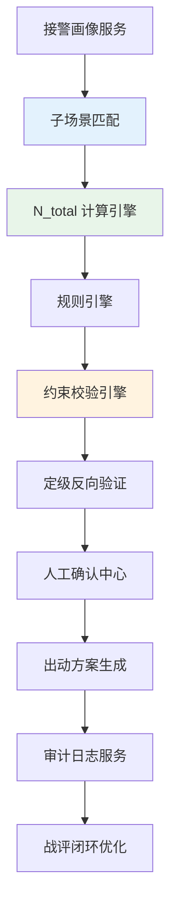

# 01_概述与核心目标

**最后更新**：2026-04-23
**负责人**：产品经理
**标签**：#调派引擎 #核心目标 #数据定力 #按出动力度定级 #闭环治理
**适用版本**：接处警 7.0 系统
**页面作用**：调派引擎模块的总入口和设计纲领

## 1. 模块概述

**调派引擎** 是接处警 7.0 系统的**核心指挥大脑**，负责从事件画像完成到最终出动方案生成的完整闭环流程。

它彻底颠覆了传统"先定级后派车"的经验模式，采用 **"事件画像 → 战术力量需求（N_total）→ 自动定级 → 编成生成 → 约束校验 → 定级反向验证 → 人工确认"** 的**数据驱动闭环**，实现"**按出动力度定级**"的核心设计原则。

**定位**：
- 不是简单的"派车工具"，而是**实战可行性保障系统**。
- 通过精确的 N_total 计算 + 多层约束校验 + 定级反向验证，确保"**不多不少、专勤专配、熟悉度与效率平衡**"。

## 2. 核心目标（5 大价值）

| 目标序号 | 核心目标               | 量化指标                     | 实现手段                          |
|----------|------------------------|------------------------------|-----------------------------------|
| 1        | **精准匹配战术需求**   | N_total 准确率 ≥ 95%         | 子场景 + 画像驱动的扩展公式       |
| 2        | **实战可行性保障**     | 实际到场率 ≥ 95%             | 三层约束校验（人员→道路→空防）   |
| 3        | **数据定力闭环**       | 定级反向验证通过率 ≥ 98%     | N_total → 等级映射 + 反向验证     |
| 4        | **责任清晰可追溯**     | 人工确认节点覆盖率 100%      | 确认中心 + 完整审计日志           |
| 5        | **高效资源利用**       | 资源利用率 85-95%，冗余 <15% | 动态保障模块 + 全局资源评估       |

## 3. 设计原则

- **数据驱动**：所有决策基于事件画像 + 10 大子场景
- **闭环治理**：正向计算 + 定级反向验证 + 战评反馈
- **人工最终负责**：系统主导计算，关键节点强制人工确认
- **可配置可扩展**：规则、系数、子场景均支持后台热更新
- **高性能高并发**：全流程 ≤ 300ms，支持 100+ 路并发
- **全链路可审计**：不可篡改日志 + 一键审计报告

## 4. 调派引擎高阶架构全景

## 5. 本模块在整个系统中的位置

- **上游**：问询管理 + 事件画像
- **下游**：资源服务（车辆/人员/GIS） + 终端推送 + 审计服务
- **并行**：指挥中心大屏、战评模块

## 6. 相关链接

- [[02_业务模型/调派规模计算模型]]
- [[02_业务模型/火灾子场景分类]]
- [[调派引擎实现细节]]
- [[约束校验实现细节]]
- [[05_人工确认与责任机制]]
- [[06_审计机制与报告模板]]
- [[07_数学模型全链路]]
- [[MOC-调派引擎]]

## 7. 变更记录

- 2026-04-23：创建本概述页，梳理核心目标、架构全景、设计原则
- 2026-01（会议纪要）：确立"按出动力度定级 + 数据定力"核心方向
- 待补充：性能指标看板、典型案例对比