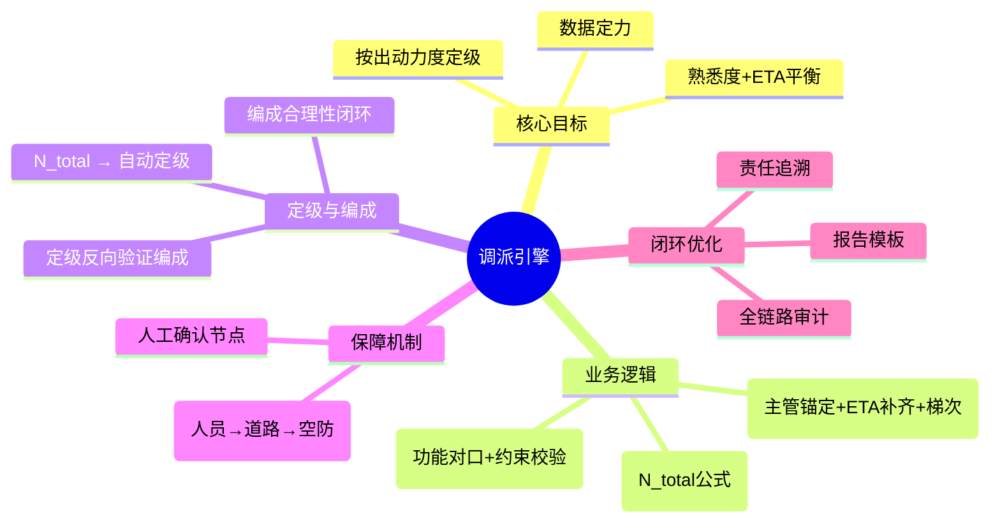

# 调派引擎模块导航

*最后更新：2026-04-23*

## 模块定位

调派引擎是接处警7.0系统的**核心决策模块**，位于智能分类之后、力量出动之前。

## 核心思维导图

## 页面索引

### 01_概述与核心目标
[[01_概述与核心目标]] — 模块定位、三大目标（数据定力、按出动力度定级、熟悉度+ETA平衡）、流程位置

### 02_业务逻辑

| 页面 | 说明 |
|---|---|
| [[02_业务模型/队站确定逻辑]] | 主管锚定+ETA补齐+梯次前置，含Mermaid流程图 |
| [[02_业务模型/车辆确定逻辑]] | 功能对口矩阵+选型流程+约束校验 |
| [[02_业务模型/调派规模计算模型]] | **核心** N_total五大因子公式+KaTeX+8个完整场景计算示例 |

### 03_定级与编成机制
[[03_定级与编成机制]] — **核心** 非线性闭环机制、警情定级映射规则表、定级反向验证逻辑（L0-L3验证层）

### 04_约束校验机制
[[04_约束校验机制]] — 人员/道路/空防三重门禁+状态机图

### 05_人工确认与责任机制
[[05_人工确认与责任机制]] — L0-L3确认节点分层、责任边界、确认中心弹窗设计

### 06_审计机制与报告模板
[[06_审计机制与报告模板]] — 全链路审计+可填写报告模板

### 07_数学模型全链路
[[07_数学模型全链路]] — 输入/优化/输出完整数学推导+KaTeX

### 08_典型场景示例
[[08_典型场景示例]] — **8个完整场景** 普通住宅/高层/化工/地下/厂房/商场/锂电池/危化品，含完整N_total计算过程

### 09_优化建议与审计发现
[[09_优化建议与审计发现]] — 高频问题分类+P0-P2优先级+持续优化机制

### 10_附录

| 页面 | 说明 |
|---|---|
| [[10_附录/公式汇总]] | 核心公式速查表（N_total、ETA、目标函数、约束条件） |

## 源文档来源

本模块基于以下原始文档构建：

| 源文档 | 对应内容 |
|---|---|
| 调派业务逻辑与规模核心模型.pdf + V2.0 + 草稿 | N_total公式、队站/车辆确定逻辑 |
| 调派引擎约束校验机制.pdf | 约束校验三重门禁 |
| 调派：责任机制与人工确认节点.pdf | 人工确认、责任机制L0-L3 |
| 对调派引擎力量编成几定级审计.pdf | 定级与编成闭环 |
| 对调派引擎生成的力量编成审计.pdf | 编成合理性审计 |
| 调派系统审计.pdf + 调派工作的审计.pdf | 审计机制 |
| 调派数学模型全链路分析.pdf | 数学模型全链路 |
| 各类火灾场景模拟.pdf | 典型场景示例 |

## 版本说明

- **适用版本**：接处警 7.0 系统调派引擎
- **标准依据**：GB 16281-2024 / GA/T 1340-2016
- **核心原则**：按出动力度定级（先算N_total，再自动定级）
