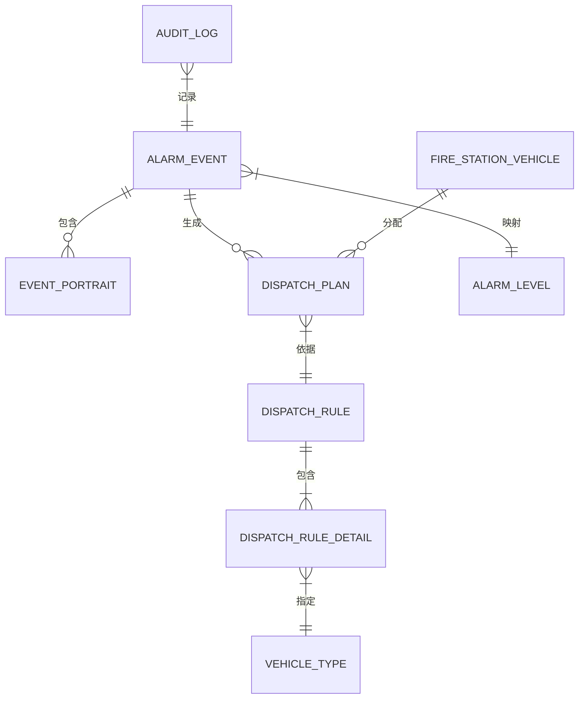

# 02_ER图与关系模型

**最后更新**：2026-04-23

## 1. 实体关系图（Mermaid）

## 2. 关键关系说明
- AlarmEvent 1:N DispatchPlan
- DispatchRule 1:N DispatchRuleDetail
- DispatchRuleDetail N:1 VehicleType

**相关链接**：[[03_数据库表结构]]