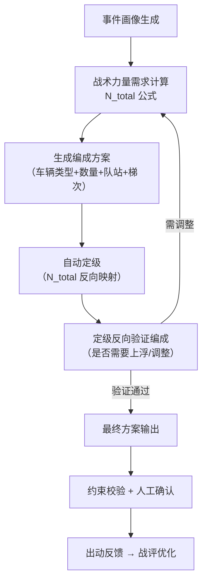
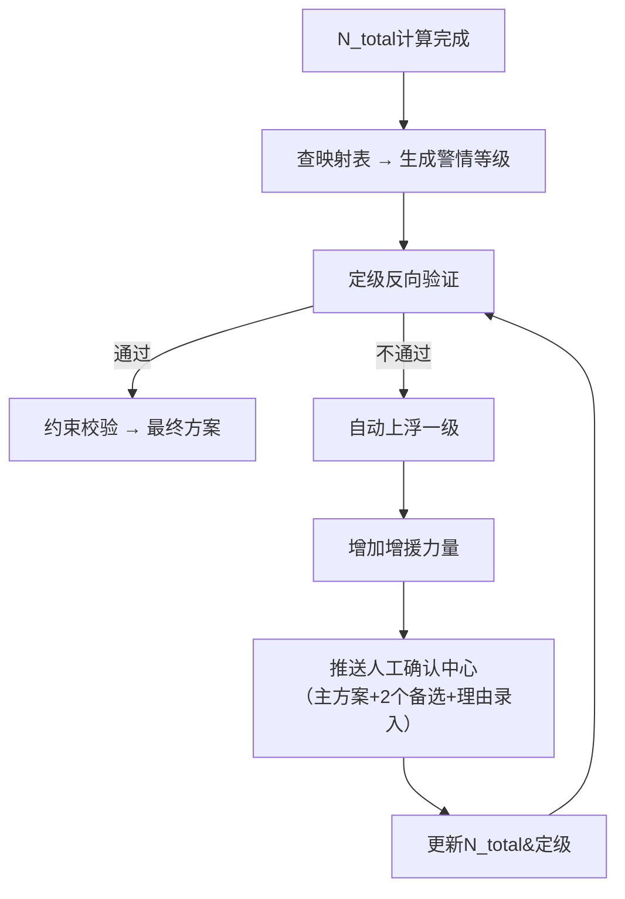

# 定级与编成机制

**最后更新**：2026-04-23
**负责人**：产品经理
**适用版本**：接处警 7.0 系统调派引擎

## 1. 概述

在接处警7.0系统中，"**编成**"指最终调派方案中的出动力量组成，包括：
- 车辆数量（N_total）
- 车型类型
- 队站分配
- 梯次配置（主管 + 最近补齐 + 卫星/子站）

"**定级**"则由编成数量（N_total）**反向映射**生成，直接决定：
- 社会联动级别
- 上报级别
- 后续资源调度规模

**核心原则**：**按出动力度定级**（先计算编成需求，再自动生成等级）。
**设计理念**：彻底颠覆传统"先定级后派车"的经验模式，实现 **事件画像 → 战术力量需求 → 车辆数量 → 自动定级 → 资源分配** 的数据驱动闭环。

**高度耦合关系**：
> 编成决定定级 → 定级反向验证编成 → 形成非线性闭环，确保"不多不少、专勤专配、均衡高效"。

## 2. 核心公式（力量需求计算）

$$
N_{\text{total}} = N_{\text{base}} + \alpha_{\text{sub}} + \beta_{\text{struct}} + G_{\text{special}} + M_{\text{support}}
$$

### 公式各分项说明

| 分项 | 含义 | 典型取值示例 | 计算依据（事件画像） |
|---|---|---|---|
| **N_base** | 基础力量 | 普通住宅=2车 化工园区=5车 | 场景卡片匹配 |
| **α_sub** | 物质修正（能量要素） | 锂电池热失控+2 易燃液体>10t +3 | 能量物质类型、荷载 |
| **β_struct** | 结构修正（空间要素） | 高层每30m +1举高 地下/大跨度 +2排烟/破拆 | 建筑高度、结构类型 |
| **G_special** | 特种模块 | 防化+1、照明通信+1、AED医疗+1 | 特定画像触发 |
| **M_support** | 保障模块 | 猛烈阶段或作战>1h时 +2（向上取整） | 发展阶段、预计作战时长 |

详见 [[02_业务模型/调派规模计算模型]]。

## 3. 定级与编成闭环机制（非线性闭环）

- **正向**：画像 → N_total → 编成 → 定级
- **反向**：定级验证编成合理性（防止欠派/过派）
- **闭环价值**：实现"数据定力"，确保实战效能与资源利用率平衡

## 4. 警情定级映射规则

N_total 计算完成后，系统立即查表映射生成警情等级：

| N_total 范围 | 警情等级 | 典型N_total | 对应描述 | 典型场景示例 | 联动级别 | 升级阈值 |
|---|---|---|---|---|---|---|
| **2～4 车** | **一级警** | 2 | 一般火灾/小型救援 | 普通住宅火灾 | 辖区内快速响应 | 实际可用车<2或火势发展 |
| 5～8 车 | **二级警** | 5～8 | 中等规模火灾/初期复杂救援 | 地下车库初期、中型厂房 | 支队增援 | 实际可用车<5或现场反馈扩大 |
| 9～12 车 | **三级警** | 9～12 | 较大火灾/复杂建筑救援 | 高层85m火灾、锂电池仓库 | 跨区调派+特种 | 实际可用车<8或被困人数显著增加 |
| 13～18 车 | **四级警** | 13～18 | 重大火灾/危化品救援 | 化工园区火灾 | 全市联动+专家组 | 实际可用车<12或多警情并发 |
| 19车及以上 | **五级警** | 19+ | 特别重大/大规模灾害 | 大面积化工泄漏+多人被困 | 全省/跨省联动+国家支援 | 实际可用车<18或火势失控 |

**边界处理**：取上限值映射（例如N_total=12 → 三级，N_total=13 → 四级）。M_support计入N_total，但不单独改变等级。最终等级 = max(公式映射等级, 人工/现场反馈等级)。

## 5. 定级反向验证逻辑

### 触发条件

系统在以下情况**强制触发**反向验证：

| 触发场景 | 触发条件 | 验证重点 |
|---|---|---|
| 常规定级后 | 每次N_total计算完成 | 可用车辆数 vs N_total |
| 实际可用力量不足 | 可用车 < min_qty（或差距≥3车）| 数量+类型匹配 |
| 现场反馈异常 | 火势蔓延/被困人数增加 | 动态升级 |
| 多警情并发 | 全局资源紧张（在位率<阈值）| 全局冗余评估 |
| 置信度低 | 核心槽位置信度<80% | 人工确认后再次验证 |

### 验证三层逻辑

1. **数量层验证**（首要）
   - 比较：实际可用车辆总数 vs 计算N_total
   - 若差距≥3车 → 判定不匹配

2. **类型与功能层验证**
   - 检查关键车型是否齐全（举高、细水雾、防化、排烟等）
   - 示例：高层场景必须包含至少3辆举高模块

3. **可持续性层验证**
   - 出动后辖区在位率是否≥50-60%
   - 保障模块是否满足长时作战需求

### 验证结果处理

## 6. 编成合理性优势（实战体现）

- **需求匹配合理**：N_total公式直接对应战术需求（灭火流量、举高高度、搜救单元），覆盖率>95%
- **功能对口**：能量物质（如锂电池）强制细水雾/机器人；结构（如地下）强制排烟/破拆
- **平衡机制**：
  - 主管锚定（辖区队在位率≥70%才能出动，优先熟悉本地水源/重点单位）
  - ETA补齐+梯次响应
  - 保障模块仅长时/猛烈触发（资源利用率85-95%，冗余<15%）
- **实战合理体现**：
  - 普通住宅火灾：编成2-4车 → 一级警
  - 高层85m火灾：编成8-12车 → 三级警（含3辆举高）
  - 化工园区：编成12-20车 → 四/五级警（倍增抗溶/防化）

## 7. 典型场景配置示例

| 场景类型 | N_base | α_sub | β_struct | G_special | M_support | **N_total** | **自动定级** | 备注 |
|---|---|---|---|---|---|---|---|---|
| 普通住宅火灾 | 2 | 0 | 0 | 0 | 0 | 2-4 | 一级 | 快速响应不浪费 |
| 高层85m火灾 | 4 | +2 | +2 | 0 | +1 | 9 | 三级 | 强制3辆举高模块 |
| 化工园区火灾 | 5 | +3 | +2 | +2 | +2 | 14 | 四/五级 | 倍增防化/抗溶 |
| 地下车库火灾 | 3 | +1 | +2 | +1 | +1 | 8-10 | 二/三级 | 增加排烟/破拆 |
| 城中村火灾 | 3 | 0 | +1 | 0 | 0 | 4 | **一级**(边界) | 考虑巷道限制 |

## 8. 升级与调整机制

当实际可用车辆 < min_qty 或现场反馈"火势蔓延/被困人数增加"时：
- 自动提升一级响应
- 增加增援力量
- 记录理由（用于审计追溯）

## 9. 审计追溯要求

每次定级生成必须完整记录（不可篡改）：
- 计算N_total各分项值
- 初始映射等级
- 实际可用车辆明细（数量、类型、ETA、在位率）
- 验证结果（通过/不通过+具体原因）
- 处理动作（上浮级别、增援车辆、人工理由）
- 时间戳+操作人

详见 [[06_审计机制与报告模板]]。

## 10. 相关链接

- [[02_业务模型/调派规模计算模型]] — N_total公式与参数标定
- [[02_业务模型/队站确定逻辑]] — 队站分配逻辑
- [[02_业务模型/车辆确定逻辑]] — 车辆选型逻辑
- [[04_约束校验机制]] — 约束校验三重门禁
- [[05_人工确认与责任机制]] — L0-L3确认节点
- [[06_审计机制与报告模板]] — 审计报告结构

## 11. 变更记录

- 2026-04-23：完整版发布，整合全部PDF中编成合理性分析、闭环机制、定级映射、反向验证
- 2026-04-23：修正版 — 纠正N_total范围最小值为2（原误写为1），修正"熟悉度≥80%"为源PDF明确表述"辖区队在位率≥70%"，城中村N_total=4标注为一级边界
- 2026-01（会议纪要）：确立"按出动力度定级"核心原则
- 待补充：代码伪实现 + Excel配置模板
