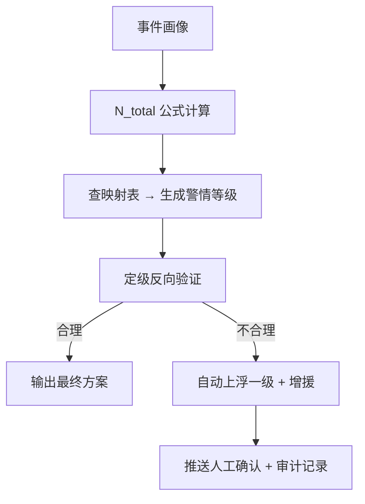

# 警情定级映射规则

**最后更新**：2026-04-23
**负责人**：产品经理
**标签**：#定级 #警情等级 #N_total #按出动力度定级 #映射规则 #闭环验证
**适用版本**：接处警 7.0 系统调派引擎

## 1. 概述

**警情定级**（警情等级）由 **N_total**（调派车辆总数量）直接反向映射生成，彻底实现"**按出动力度定级**"的核心原则。

**作用**：
- 决定社会联动规模（公安、医疗、环保等）
- 决定上报级别（支队/总队/省厅）
- 决定后续增援与资源调度
- 作为审计和战评的重要依据

**映射逻辑**：N_total 计算完成后立即查表映射，同时进行**定级反向验证**，确保编成与等级相互印证。

## 2. 警情定级映射规则表（优化版）

| N_total 范围       | 警情等级     | 典型 N_total | 对应描述                     | 典型子场景示例                  | 联动级别               | 升级阈值（自动触发）                  |
|--------------------|--------------|--------------|------------------------------|---------------------------------|------------------------|---------------------------------------|
| **1～4 车**        | **一级警**   | 2～4         | 一般火灾 / 小型救援          | 普通住宅火灾                    | 辖区内快速响应         | 实际可用车 < 2 或火势发展             |
| **5～8 车**        | **二级警**   | 5～8         | 中等规模火灾 / 初期复杂救援  | 地下车库初期、电动车火灾        | 支队增援               | 实际可用车 < 5 或现场反馈扩大         |
| **9～12 车**       | **三级警**   | 9～12        | 较大火灾 / 复杂建筑救援      | 高层住宅、锂电池仓库、商业综合体| 跨区调派 + 特种        | 实际可用车 < 8 或被困人数显著增加     |
| **13～18 车**      | **四级警**   | 13～18       | 重大火灾 / 危化品救援        | 化工园区、工业厂房              | 全市联动 + 专家组      | 实际可用车 < 12 或多警情并发          |
| **19 车及以上**    | **五级警**   | 19+          | 特别重大火灾 / 大规模灾害    | 大面积危化泄漏 + 多人被困       | 全省/跨省联动 + 国家支援 | 实际可用车 < 18 或火势失控            |

**边界处理规则**：
- 取**上限值**映射（例如 N_total=12 → 三级，N_total=13 → 四级）。
- M_support（保障模块）计入 N_total，但不单独改变等级。
- 最终等级 = max(公式映射等级, 人工/现场反馈等级)。

## 3. 定级生成与反向验证流程

## 4. 与 10 大子场景的映射示例

| 子场景             | 计算 N_total | 映射等级 | 联动级别       | 备注                     |
|--------------------|--------------|----------|----------------|--------------------------|
| 普通住宅火灾       | 2～4         | 一级     | 辖区内         | 快速响应                 |
| 高层住宅火灾       | 8～12        | 三级     | 跨区 + 特种    | 强制举高 + 细水雾        |
| 地下车库火灾       | 7～10        | 二~三级  | 支队增援       | 可快速升级至三级         |
| 化工园区火灾       | 13～20       | 四级     | 全市联动       | 倍增防化                 |
| 锂电池仓库火灾     | 10～15       | 三~四级  | 跨区 + 特种    | 防止复燃                 |

（完整 10 个子场景映射见 [[火灾子场景分类]]）

## 5. 特殊情况处理

- **置信度低**：核心槽位置信度 <80% 时，**必须人工确认** 后再映射定级。
- **多警情并发**：全局资源紧张时，可临时下调非关键警情等级（必须记录理由）。
- **现场反馈**：出动后反馈"火势蔓延""被困人数增加"时，自动上浮一级并增援。

## 6. 配置与扩展建议

- **后台可配置**：每条范围、典型值、联动建议均支持支队/大队自定义。
- **未来扩展**：支持"季节权重""人员密集度系数"等动态调整因子。
- **审计要求**：每次定级生成必须记录"计算 N_total + 映射依据 + 反向验证结果"。

## 7. 相关链接

- [[02_业务模型/调派规模计算模型]]
- [[02_业务模型/火灾子场景分类]]
- [[02_业务模型/子场景画像/MOC-子场景画像]]
- [[定级反向验证逻辑详解]]
- [[01_概述与核心目标]]

## 8. 变更记录

- 2026-04-23：优化版发布，范围精准化、新增典型 N_total、联动级别、升级阈值列
- 2026-01：确立"按出动力度定级"原则