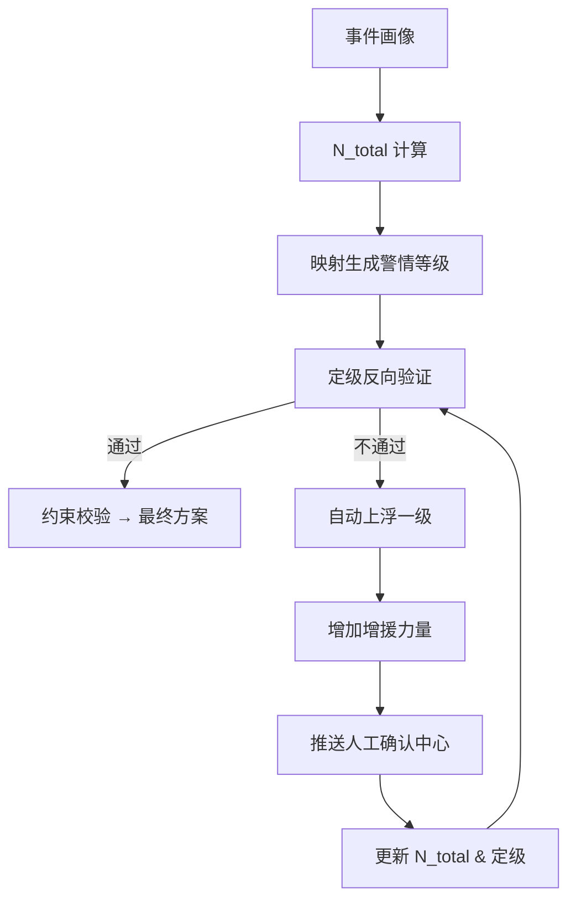

# 定级反向验证逻辑详解

**最后更新**：2026-04-23
**负责人**：产品经理
**标签**：#定级反向验证 #闭环机制 #数据定力 #自动升级 #编成合理性 #审计追溯
**适用版本**：接处警 7.0 系统调派引擎
**页面作用**：定级反向验证的核心实现文档，供产品，开发、支队使用

## 1. 概述

**定级反向验证** 是调派引擎中 **"编成决定定级，定级反向验证编成"** 的非线性闭环核心机制。

- **正向流程**：事件画像 → N_total 计算 → 映射生成警情等级
- **反向验证**：生成警情等级后，立即校验**实际可用力量**（车辆数量、类型、队站、在位率）是否与该等级的编成需求匹配
- **核心目标**：确保"**不多不少、恰到好处**"，防止欠派（救援延误）或过派（资源浪费），实现真正的**数据定力**

**设计理念**：
- 彻底摆脱"先定级后派车"的经验模式
- 任何不匹配均触发**自动升级 + 增援**，同时记录审计日志

**验证时机**：N_total 计算完成 → 定级映射完成 → 约束校验之前（毫秒级完成）

## 2. 触发条件

系统在以下情况**强制触发**反向验证：

| 触发场景               | 触发条件                                      | 验证重点                  |
|------------------------|-----------------------------------------------|---------------------------|
| 常规定级后             | 每次 N_total 计算完成                         | 可用车辆数 vs N_total     |
| 实际可用力量不足       | 可用车 < min_qty 或差距 ≥ 3 车                | 数量 + 类型匹配           |
| 现场反馈异常           | 出动后反馈"火势蔓延""被困人数增加"           | 动态升级                  |
| 多警情并发             | 全局资源紧张（在位率 < 阈值）                 | 全局冗余评估              |
| 置信度低               | 核心槽位置信度 < 80%                          | 人工确认后再次验证        |

## 3. 详细验证逻辑（三层）

1. **数量层验证**（首要）
   - 比较实际可用车辆总数 vs 计算 N_total
   - 差距 ≥ 3 车 或 可用车 < min_qty → 不通过

2. **类型与功能层验证**
   - 检查关键车型是否齐全（举高、细水雾、防化、排烟等）
   - 示例：高层场景必须包含至少 3 辆举高模块

3. **可持续性层验证**
   - 出动后辖区在位率是否 ≥ 50-60%
   - 保障模块是否满足长时作战需求

## 4. 处理流程（Mermaid）

## 5. 典型场景验证示例

| 子场景             | 计算 N_total | 初始等级 | 实际可用车辆 | 验证结果     | 处理动作                     | 最终等级 |
|--------------------|--------------|----------|--------------|--------------|------------------------------|----------|
| 高层 85m + 锂电池 | 9            | 三级     | 6 车（缺举高）| 不通过       | 上浮一级 + 增援 3 辆         | 四级     |
| 化工园区           | 14           | 四级     | 11 车        | 不通过       | 上浮 + 跨区特种 + 人工确认   | 五级     |
| 普通住宅           | 3            | 一级     | 4 车         | 通过         | 直接出动                     | 一级     |
| 地下车库（现场反馈扩大） | 8      | 二级     | 8 车         | 现场反馈不通过 | 自动上浮 + 增援排烟车       | 三级     |

## 6. 人工介入与责任机制

**必须人工确认** 的场景：
- 差距 ≥ 3 车
- 关键特种车辆缺失
- 多警情并发导致全局资源紧张

**界面设计**：确认中心弹窗（左侧必要数据 + 右侧 3 个备选方案 + 强制录入理由）

**责任主体**：指挥员/接警员（系统仅辅助，最终责任由人工承担）

## 7. 审计与追溯要求

每次反向验证必须完整记录：
- 计算 N_total 各分项值
- 初始映射等级
- 实际可用车辆明细（数量、类型、ETA、在位率）
- 验证结果 + 具体原因
- 处理动作（上浮级别、增援车辆、人工理由）
- 时间戳 + 操作人 + SHA256 哈希

## 8. 相关链接

- [[02_业务模型/调派规模计算模型]]
- [[警情定级映射规则]]
- [[02_业务模型/火灾子场景分类]]
- [[02_业务模型/子场景画像/MOC-子场景画像]]
- [[01_概述与核心目标]]
- [[04_数据模型/MOC-数据模型]]
- [[03_调派引擎/06_审计机制与报告模板]]

## 9. 变更记录

- 2026-04-23：完整版发布，整合三层验证、典型示例、人工确认、审计要求
- 2026-01（会议纪要）：确立"编成决定定级，定级反向验证编成"非线性闭环原则