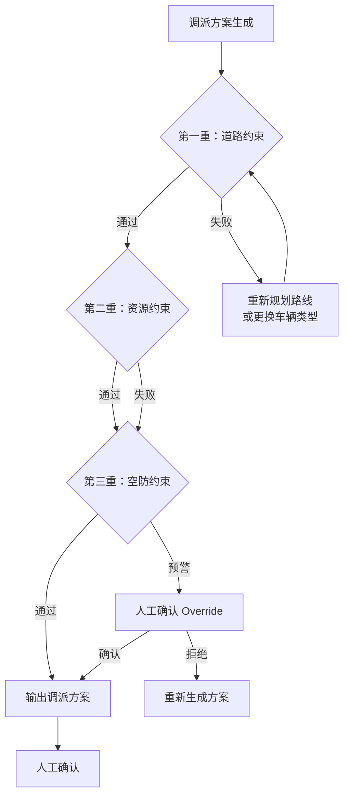
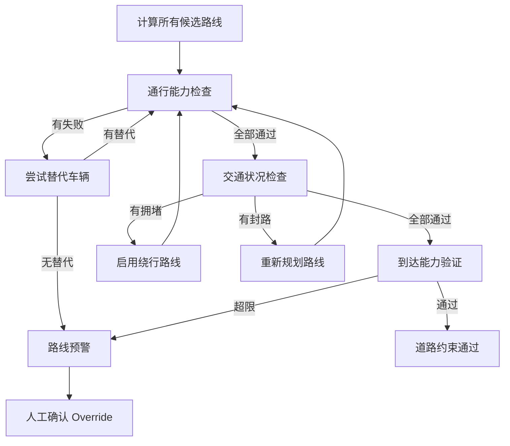
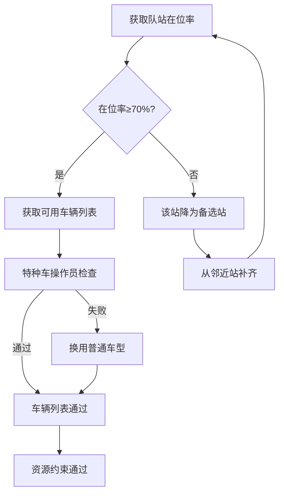
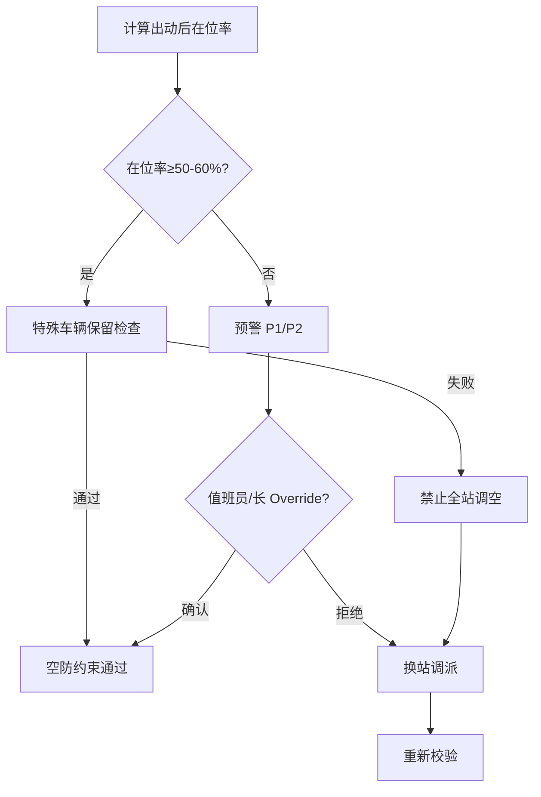
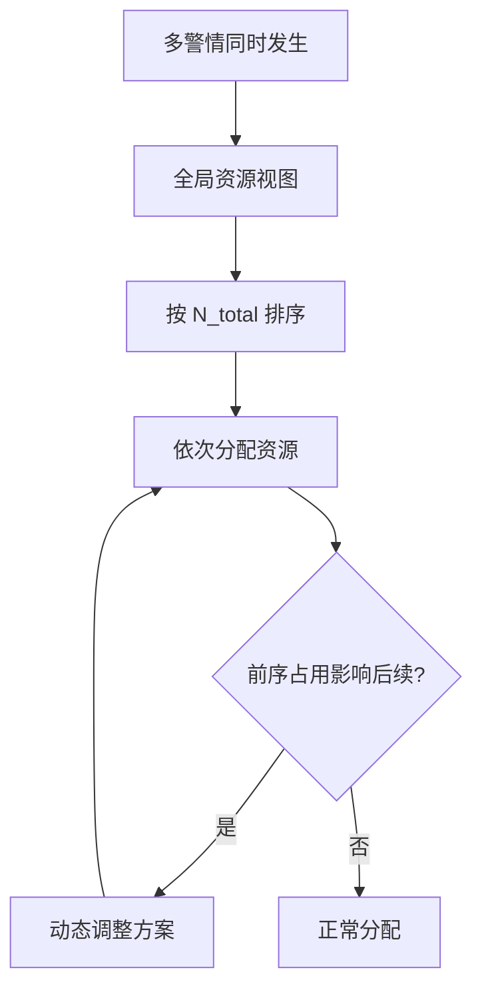

# 约束校验机制

**最后更新**：2026-04-23
**适用版本**：接处警 7.0 系统调派引擎

## 1. 概述

**位置**：调派方案生成之后、人工确认之前

**核心目标**：在方案输出前对调派计划进行**道路通行**、**资源可用**、**空防保留**三个维度的全面校验，确保"出得去、到得了、能持续"。

**校验顺序**（与源 PDF 一致）：

```
道路约束 → 资源约束 → 空防约束
```

**与 [[07_数学模型全链路]] 的关系**：

| 约束维度 | 校验内容 | 对应数学模型约束 |
|---|---|---|
| **道路约束** | 通行能力、交通状况、到达能力 | 道路可达性约束 |
| **资源约束** | 队站资源、车辆、人员可用性 | 数量+人员约束 |
| **空防约束** | 辖区保留最低战力 | 空防在位率约束 |

## 2. 校验流程总览



## 3. 第一重：道路约束

### 3.1 约束目标

确保调派路线**可行**，车辆能**物理到达**现场。

### 3.2 校验维度

道路约束包含**三个子维度**：

#### A. 通行能力约束

| 约束项 | 校验内容 | 失败处理 |
|---|---|---|
| **限高** | 车辆高度 ≤ 桥洞/隧道净空高度 | 换用矮型车辆 |
| **限重** | 车辆总重 ≤ 道路承重 | 换用轻型车辆 |
| **转弯半径** | 车辆最小转弯半径 ≤ 道路转弯半径 | 换用小型/短轴距车辆 |

#### B. 交通状况约束

| 约束项 | 校验内容 | 数据来源 | 失败处理 |
|---|---|---|---|
| **拥堵系数** | ETA = 距离 / (平均车速 × 拥堵系数) | 高德/百度交通API（实时）| 启用备选站或绕行 |
| **封路** | 道路是否封闭施工 | 交通 API（实时）| 绕行路线规划 |
| **交通管制** | 危化品车/重车的时段/路线限制 | 交通数据库 | 换时段或换路线 |

#### C. 到达能力约束

| 约束项 | 校验内容 | 计算公式 |
|---|---|---|
| **ETA 上限** | 首车到场时间 ≤ 可接受阈值 | ETA ≤ 10min（城市）|
| **水源可达** | 取水点是否在合理范围内 | 水源距离 ≤ 2km |

### 3.3 校验流程



### 3.4 典型场景

| 场景 | 道路风险 | 处理 |
|---|---|---|
| 城中村巷道 | 重型车无法通行 | 仅派小型车（≤3吨） |
| 高层建筑下方 | 举高车净空不足（广告牌/电线）| 人工确认或换用登高平台 |
| 化工区夜间 | 危化品车路线限制 | 提前规划危化品运输路线 |
| 跨江通道 | 桥梁限重/限行 | 绕行或换用轻型车 |

---

## 4. 第二重：资源约束

### 4.1 约束目标

确保调派的队站和车辆资源**真正可用**，杜绝"鬼车出警"。

### 4.2 校验维度

资源约束包含**三个子维度**：

#### A. 队站资源可用性

| 约束项 | 阈值 | 说明 | 失败处理 |
|---|---|---|---|
| **辖区队在位率** | **≥70%** | 当前在位车辆 / 编制车辆 | 低于70%时该站**不可作为主管站** |
| **辖区队可用车辆数** | ≥ 调派需求 | 该站在位且可出动的车辆数 | 从邻近站补齐 |

#### B. 车辆可用性

| 约束项 | 校验内容 | 失败处理 |
|---|---|---|
| **车辆状态** | 当前状态为"可用"（非维修/出差/训练）| 自动排除，换备用车辆 |
| **特种装备** | 特种车辆（举高/防化等）需在位 | 无替代则需人工确认 |

#### C. 人员可用性

| 约束项 | 阈值 | 校验内容 | 失败处理 |
|---|---|---|---|
| **驾驶员** | 每车至少1名驾驶员在位 | 无驾驶员车辆不可派出 | 从备选池补位 |
| **特种操作员** | 举高/防化等需持证操作 | 无证人员不可操作特种车 | 换用普通车型或人工确认 |

### 4.3 校验流程



### 4.4 源 PDF 原文关键定义

> "辖区队在位率 **70%** 以上才能出动"

**注意**：辖区队在位率≥70%是**资源约束**的核心指标，低于此值该站不能作为主管站出动。

### 4.5 典型场景

| 场景 | 资源风险 | 处理 |
|---|---|---|
| 深夜值班 | 驾驶员在位率可能<70% | 该站仅能补齐，不能主管 |
| 多站同时报警 | 某站被重复调用 | 全局资源统筹 |
| 特种车辆稀缺 | 防化车仅1辆且在位 | 人工确认后派车 |

---

## 5. 第三重：空防约束

### 5.1 约束目标

防止调空辖区，确保**辖区保留最低战力**应对后续警情。

### 5.2 校验维度

| 约束项 | 阈值 | 说明 | 触发动作 |
|---|---|---|---|
| **辖区保留在位率** | **≥50-60%** | 出动后的在位率 | 低于阈值 → **预警** |
| **特殊车辆保留** | ≥1辆举高/防化 | 本部需保留特种战力 | 无保留 → **预警** |
| **本部保留主战车** | ≥1辆 | 必须保留最小作战单元 | 无保留 → **禁止全站调空** |

### 5.3 校验流程



### 5.4 预警分级

| 级别 | 条件 | 要求 | 结果 |
|---|---|---|---|
| **P1 预警** | 在位率 50-60% | 值班员确认 | Override 可继续 |
| **P2 预警** | 特殊车辆不足 | 值班长确认 | Override 可继续 |
| **P3 禁止** | 本部无主战车 | 禁止调空 | 必须换站 |

### 5.5 典型场景

| 场景 | 空防风险 | 处理 |
|---|---|---|
| 大火情多站联动 | 某站可能被调空 | 全局统筹，轮流调空 |
| 连续多警情 | 资源快速消耗 | 启动跨区增援机制 |
| 特殊车辆全出 | 本地无特种战力 | 人工确认+记录 |

---

## 6. 三重约束对比表

| 约束维度 | 校验重点 | 阈值 | 数据来源 | 更新频率 |
|---|---|---|---|---|
| **道路约束** | 通行能力 | 限高/限重/转弯半径 | 道路数据库+交通API | 实时/月度 |
| **道路约束** | 交通状况 | 拥堵系数/封路 | 高德/百度API | **实时** |
| **道路约束** | 到达能力 | ETA ≤ 上限 | 距离/车速计算 | 实时 |
| **资源约束** | 队站在位率 | **≥70%** | 人员在位系统 | **实时** |
| **资源约束** | 车辆可用 | 状态=可用 | 车辆管理系统 | **实时** |
| **资源约束** | 人员可用 | 每车≥1驾驶员 | 人员在位系统 | **实时** |
| **空防约束** | 保留在位率 | ≥50-60% | 调度系统 | **实时** |
| **空防约束** | 特殊车辆保留 | ≥1辆 | 车辆管理系统 | **实时** |
| **空防约束** | 主战车保留 | ≥1辆 | 调度系统 | **实时** |

---

## 7. 特殊场景处理

### 7.1 多警情并发



### 7.2 恶劣天气

| 天气条件 | 道路约束影响 | 处理 |
|---|---|---|
| 大雾 | 拥堵系数 ×1.5 | ETA 上浮 50% |
| 暴雨/暴雪 | 拥堵系数 ×2.0 | 禁止重型车上路 |
| 结冰 | 全部车辆限速 | 全部车辆降速运行 |
| 台风/洪水 | 道路封闭 | 启用应急备选方案 |

### 7.3 夜间/节假日

- 驾驶员在位率可能低于 70% → 该站自动降为补齐站
- 需提前预警，触发人员召回机制

---

## 8. 与其他模块的关系

| 上游 | 本模块 | 下游 |
|---|---|---|
| [[02_业务模型/车辆确定逻辑]] | 三重约束校验 | [[05_人工确认与责任机制]] |
| N_total + 队站 + 车型 | 道路→资源→空防 | 通过→人工确认 / 失败→调整 |

---

## 9. 相关链接

- [[02_业务模型/车辆确定逻辑]] — 约束校验的输入来源
- [[02_业务模型/队站确定逻辑]] — 队站确定逻辑
- [[05_人工确认与责任机制]] — Override 机制和责任边界
- [[03_定级与编成机制]] — 约束失败时的升级处理
- [[06_审计机制与报告模板]] — 校验日志的审计应用

## 10. 变更记录

- 2026-04-23：修正版 — 纠正校验顺序（道路→资源→空防），修正辖区队在位率70%归属（资源约束而非空防约束）
- 原始版错误已纠正
