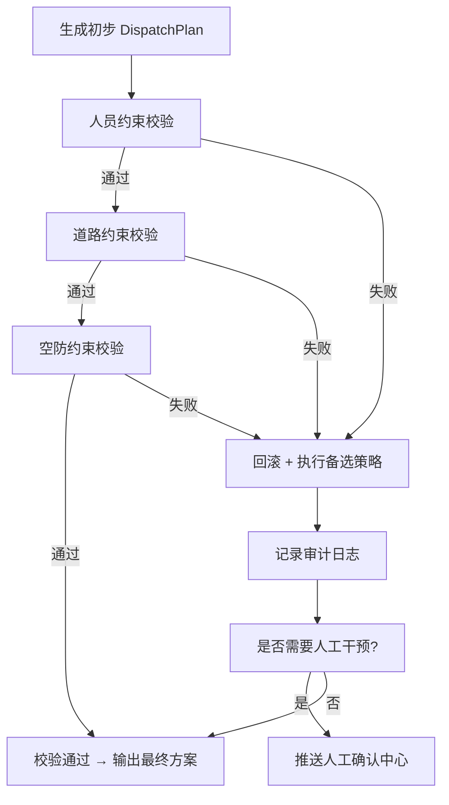

# 约束校验实现细节

**最后更新**：2026-04-23
**标签**：#约束校验 #ConstraintValidator #硬性闭环 #回滚策略 #实战可行性
**适用版本**：接处警 7.0 系统调派引擎
**页面作用**：开发、测试、运维人员实现参考文档

## 1. 概述

**约束校验** 是调派引擎的**最后一道硬性闭环**，位于资源分配完成、最终方案输出之前。
其核心作用是确保方案从"理论可用"转向"实战可行"，防止"派得出、到不了"或"调空辖区"。

**设计原则**（来源于所有 PDF）：
- 校验顺序：**人员约束 → 道路约束 → 空防约束**（由近及远、由个体到整体）
- 触发机制：**硬性失败立即回滚** + **软性预警**
- 回滚策略：本地备选 → 次优队站 → 降级车型 → 人工干预
- 性能要求：**全过程 ≤ 300ms**
- 数据来源：态势层（实时人员、GPS、路网） + 基础信息层

## 2. 整体校验流程（Mermaid）



## 3. 三层约束详细实现

### 3.1 人员约束（首要、最严格）

```java
ValidationResult checkPersonnel(DispatchPlan plan) {
    for (VehicleAssignment va : plan.getAssignments()) {
        // 1. 驾驶员在位 + 驾照匹配
        if (!personnelService.hasValidDriver(va.getVehicle(), va.getStation())) {
            return fail("驾驶员不足或证件不匹配");
        }
        // 2. 特种操作员在位率 ≥ 70%
        double opRate = personnelService.getOperatorRate(va.getVehicle());
        if (opRate < 0.70) {
            return fail("特种操作员在位率不足");
        }
    }
    return pass();
}
```

### 3.2 道路约束

```java
ValidationResult checkRoad(DispatchPlan plan) {
    for (VehicleAssignment va : plan.getAssignments()) {
        PathConstraint pc = gisService.getPathConstraint(va.getVehicle(), va.getRoute());
        if (!pc.isPassable()) {   // 限高、限重，施工、拥堵
            // 自动拆分：重型 → 多辆小型
            plan.splitHeavyVehicle(va);
            return retryAfterSplit();
        }
    }
    return pass();
}
```

### 3.3 空防约束（全局可持续性）

```java
ValidationResult checkAirDefense(DispatchPlan plan) {
    double afterRate = resourceService.getPostDispatchInPositionRate(plan);
    if (afterRate < 0.50) {   // 出动后辖区在位率 < 50%
        return fail("调空辖区风险过高");
    }
    return pass();
}
```

## 4. 回滚与备选策略（核心实现）

```java
private DispatchPlan handleFailure(DispatchPlan original, ValidationResult result) {
    // 策略优先级
    if (canUseLocalBackup(original)) {
        return useLocalBackup(original);           // 1. 本地备选车辆
    }
    if (canUseNextStation(original)) {
        return useNextStation(original);           // 2. 次优队站
    }
    if (canDowngradeVehicle(original)) {
        return downgradeVehicle(original);          // 3. 降级车型（重型→小型）
    }
    // 4. 最终人工干预
    humanConfirmService.pushWithFailureReason(original, result);
    return original;   // 保留原方案等待人工
}
```

## 5. 性能与并发优化

- **缓存**：车辆状态、路网约束 Redis 缓存（TTL 3s）
- **异步**：审计日志异步写入，不阻塞主流程
- **分布式锁**：多警情并发时对全局资源加锁
- **预计算**：常用路径、常用车型预生成约束结果
- **监控**：Prometheus 指标（校验耗时、失败率、回滚次数）

## 6. 审计与日志要求

每次校验必须记录：
- 校验步骤（人员/道路/空防）
- 输入方案快照
- 失败原因 + 具体字段
- 回滚动作
- 操作人 / 系统自动
- SHA256 哈希（不可篡改）

## 7. 与其他模块集成点

- **资源服务**：实时提供人员、车辆、GPS 数据
- **GIS 服务**：提供道路约束、ETA、路径
- **N_total 计算器**：提供 min_qty 作为校验基准
- **人工确认中心**：失败时推送
- **审计服务**：全链路日志

## 8. 异常处理与边界情况

- 所有约束都失败 → 强制人工 + 使用最低安全编成
- 网络/GIS 服务不可用 → 使用缓存最后一次结果 + 告警
- 高峰期全局资源紧张 → 软性降级非关键警情

## 9. 相关链接

- [[调派规模计算模型]]
- [[定级反向验证逻辑详解]]
- [[调派引擎实现细节]]
- [[04_数据模型/MOC-数据模型]]
- [[火灾子场景分类]]

## 10. 变更记录

- 2026-04-23：完整实现细节文档发布，包含三层校验、回滚策略、伪代码
- 2026-01：约束校验机制确立