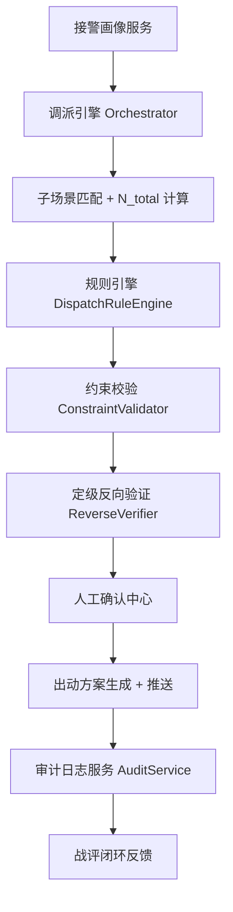
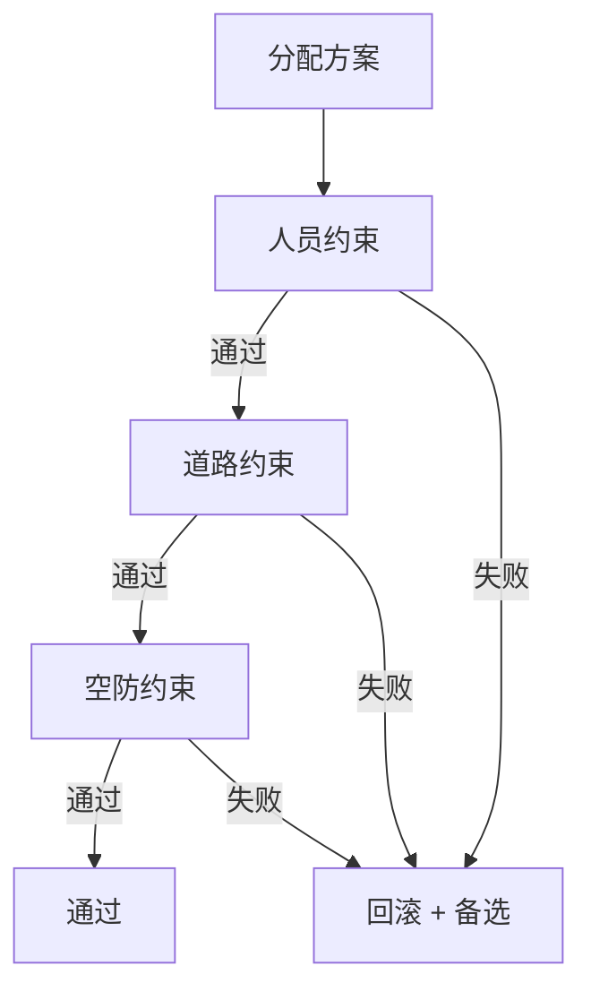

# 调派引擎实现细节

**最后更新**：2026-04-23
**标签**：#调派引擎 #实现细节 #技术架构 #规则引擎 #N_total #工程落地
**适用版本**：接处警 7.0 系统
**页面作用**：开发、测试、运维人员的实现参考文档

## 1. 总体技术架构

**调派引擎** 采用 **分层 + 规则引擎 + 事件驱动** 架构：



- **核心组件**：
  - Orchestrator（主控器）
  - RuleEngine（规则引擎）
  - Calculator（N_total 计算器）
  - Validator（约束校验器）
  - Verifier（反向验证器）
  - AuditService（审计服务）

**技术栈推荐**：
- 语言：Java / Kotlin（或 Go / Python）
- 规则引擎：Drools / Easy Rules / 自定义 JSON Rule Engine
- 数据库：PostgreSQL（JSONB 支持 conditions）
- 缓存：Redis（实时车辆状态）
- 消息队列：Kafka / RabbitMQ（异步审计 + 推送）

## 2. 核心流程伪代码实现

```java
public DispatchPlan executeDispatch(AlarmEvent event) {
    // 1. 画像 + 子场景匹配
    EventPortrait portrait = portraitService.build(event);
    String subScene = sceneMatcher.match(portrait);   // 10大子场景之一

    // 2. N_total 计算（扩展公式）
    int nTotal = nTotalCalculator.calculate(portrait, subScene);

    // 3. 规则匹配 + 编成生成
    List<DispatchRule> rules = ruleEngine.findMatchingRules(portrait, nTotal);
    DispatchPlan plan = planGenerator.generate(rules, portrait);

    // 4. 约束校验
    ValidationResult result = constraintValidator.validate(plan);
    if (!result.isPassed()) {
        plan = handleConstraintFailure(plan, result);
    }

    // 5. 定级反向验证
    LevelVerificationResult verify = reverseVerifier.verify(nTotal, plan);
    if (!verify.isPassed()) {
        plan = upgradeAndReplan(verify, plan);   // 自动上浮 + 增援
    }

    // 6. 人工确认（必要时）
    if (needHumanConfirm(portrait, verify)) {
        humanConfirmService.push(plan);
    }

    // 7. 审计 + 推送
    auditService.logFullChain(event, plan);
    dispatchPushService.send(plan);

    return plan;
}
```

## 3. N_total 计算器实现细节（扩展版）

```java
public int calculate(EventPortrait p, String subScene) {
    int n = baseService.getBase(subScene);           // N_base

    n += substanceModifier.calc(p.getEnergyType());  // α_sub
    n += structureModifier.calc(p.getHeight(), p.getStructureType()); // β_struct
    n += specialModuleService.calc(p);               // G_special
    n += supportModuleService.calc(p.getStage());    // M_support

    // 新增扩展
    n += confidenceModifier.calc(p.getAvgConfidence()); // Δ_confidence
    n += sceneDeltaService.calc(subScene, p);            // Δ_scene

    return Math.max(n, 2);   // 最低2车
}
```

**配置化实现**：所有 modifier 读取后台规则表（JSONB），支持热更新。

## 4. 规则引擎实现细节

- **数据结构**：
  - `DispatchRule` + `DispatchRuleDetail`（1:N）
  - `conditions` 使用 JSONB 存储复杂条件
- **匹配算法**：
  1. 精确匹配 alarm_level + alarm_type
  2. 模糊匹配 conditions（JSONPath 或自定义表达式）
  3. 优先级排序（priority 字段）
- **性能**：规则预加载 + Redis 缓存，单次匹配 < 10ms

## 5. 约束校验实现细节（逐层硬性检查）



- **人员约束**：在位率 ≥ 70%，特种操作证匹配
- **道路约束**：GIS + 路网实时数据（限高/限重/施工）
- **空防约束**：出动后辖区在位率 ≥ 50-60%
- 失败处理：自动回滚 → 本地备选 → 降级车型 → 人工干预

## 6. 定级反向验证实现细节

```java
public LevelVerificationResult verify(int nTotal, DispatchPlan plan) {
    int available = resourceService.getAvailableVehicles();
    if (available < nTotal - 3) {
        return new LevelVerificationResult(false, "可用车辆不足", nTotal + 3);
    }
    // 类型检查、可持续性检查...
    return new LevelVerificationResult(true);
}
```

## 7. 审计日志实现细节

- **全链路日志**：异步写入（Kafka → ClickHouse / PostgreSQL）
- **关键字段**：step、input、output、reason、operator、hash
- **不可篡改**：时间戳 + SHA256 链式签名
- **审计报告**：一键生成 PDF（基于模板）

## 8. 性能与并发考虑

- 单次调度全流程 ≤ 300ms
- 支持 100+ 并发（Redis + 分布式锁）
- 热点数据（车辆状态）Redis 缓存 + 3s 刷新
- 规则引擎预热 + 缓存

## 9. 与其他模块集成点

- **画像服务**：事件总线接收画像完成事件
- **资源服务**：实时查询车辆/GPS/人员状态
- **GIS 服务**：ETA 计算、路径规划
- **推送服务**：终端 + 语音 + 大屏
- **审计服务**：全链路日志
- **人工确认**：WebSocket 推送确认中心

## 10. 异常处理与回滚策略

- 画像失败 → 使用默认子场景 + 人工确认
- 计算异常 → 回退到固定编成 + 告警
- 约束全部失败 → 强制人工干预 + 记录

## 11. 相关链接

- [[调派规模计算模型]]
- [[火灾子场景分类]]
- [[10大子场景详细计算示例]]
- [[警情定级映射规则]]
- [[定级反向验证逻辑详解]]
- [[04_数据模型/MOC-数据模型]]

## 12. 变更记录

- 2026-04-23：完整实现细节文档发布，包含伪代码、流程图、集成点
- 2026-04：基础模型落地