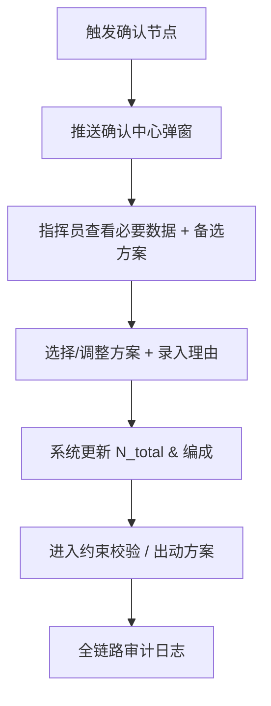

# 05_人工确认与责任机制

**最后更新**：2026-04-23
**负责人**：产品经理
**标签**：#人工确认 #责任机制 #Human-in-the-Loop #确认中心 #最终负责
**适用版本**：接处警 7.0 系统调派引擎
**页面作用**：人工确认节点与责任归属的核心设计文档

## 1. 概述

**人工确认与责任机制** 是调派引擎中**"系统主导计算 + 人工主导确认"** 的关键设计。

系统提供"数据定力"智能辅助，但涉及生命安全、资源分配、法律问责的关键决策**必须保留人工最终确认节点**，以明确责任主体（指挥员/接警员），符合《消防救援队伍接处警工作规范》"人工最终负责"原则，避免"黑箱决策"风险。

**设计理念**：
- 系统计算主方案 + 2-3 个对比备选方案
- 推送关键必要数据 + 强制录入理由
- 确认后系统立即更新方案并进入下一流程

## 2. 确认节点分层（L0-L3）

### L0 — 系统自动执行（无需确认）

| 操作 | 说明 |
|---|---|
| 接收报警信息 | 系统自动接入 |
| 基本要素提取 | AI 辅助提取，无需确认 |
| 标准一级火灾常规调派 | N_total ≤ 4，无特殊条件 |

### L1 — 值班员确认

| 触发条件 | 确认内容 |
|---|---|
| N_total > 4 | 火灾等级分类结果 |
| 有特种车型（防化/举高）| 力量编成方案 |
| 有跨区调派 | 出动指令下发 |

### L2 — 值班长审批

| 触发条件 | 审批内容 |
|---|---|
| N_total ≥ 9 | 跨区增援决策 |
| 多起警情并发 | 力量分配优先级 |
| 超标准调派 | 超出标准编成的理由 |

### L3 — 指挥中心决策

| 触发条件 | 决策内容 |
|---|---|
| N_total ≥ 15 | 区域性大规模调度 |
| 多区域联动 | 跨区域多力量协调 |
| 特别重大警情 | 国家级响应启动 |

## 3. 必须人工确认的节点及原因

| 序号 | 确认节点                     | 触发条件                          | 责任主体       | 原因（重大风险）                  |
|------|------------------------------|-----------------------------------|----------------|-----------------------------------|
| 1    | 事件画像关键槽位             | 核心槽位置信度 < 80%              | 接警员/指挥员  | 画像错误可能导致欠派/过派伤亡     |
| 2    | 定级反向验证不通过           | 可用车辆差距 ≥ 3 车或关键车型缺失 | 指挥员         | 实战可行性风险                    |
| 3    | 约束校验全部失败             | 人员/道路/空防全部不通过          | 指挥员         | 无法出动或调空辖区                |
| 4    | 重大编成调整                 | 现场反馈火势蔓延/被困人数增加     | 指挥员         | 资源调度与联动规模变更            |
| 5    | 多警情并发全局资源紧张       | 在位率 < 50%                      | 值班领导       | 防止辖区安全网破裂                |

## 4. 确认中心界面设计（弹窗）

- **左侧必要数据区**：原始报警转写、槽位列表（值+来源+置信度）、现场反馈
- **右侧方案对比区**：系统主方案 + 2-3 个备选方案（保守/中性/激进）
- **底部操作区**：
  - 一键确认主方案
  - 选择备选方案
  - 手动调整 + **强制录入理由**（必填）
  - 超时自动采用中性方案（并记录）

**界面要求**：30 秒倒计时，超时自动提醒领导介入。

## 5. 责任机制

- **系统责任**：计算准确、方案推荐、数据呈现、审计记录
- **人工责任**：最终确认、理由录入、重大决策
- **审计追溯**：每一次确认均记录操作人、时间、理由、修改前后方案（SHA256 不可篡改）
- **合规依据**：《消防救援队伍接处警工作规范》"人工最终负责"

## 6. 确认流程（Mermaid）

## 7. 审计与追溯要求

每次人工确认必须记录：
- 确认节点类型
- 原始计算方案
- 人工调整内容
- 强制录入理由
- 操作人、时间、IP
- SHA256 哈希链

## 8. 相关链接

- [[02_业务模型/调派规模计算模型]]
- [[警情定级映射规则]]
- [[定级反向验证逻辑详解]]
- [[约束校验实现细节]]
- [[01_概述与核心目标]]
- [[03_调派引擎/06_审计机制与报告模板]]

## 9. 变更记录

- 2026-04-23：完整版发布，包含确认节点表、界面设计、责任机制、流程图
- 2026-01：确立"系统计算 + 人工最终确认"原则