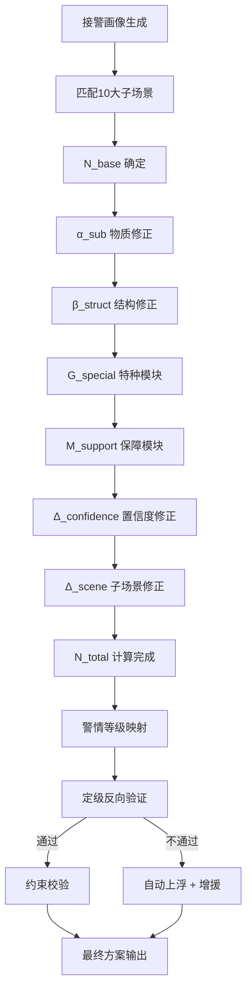

# 07_数学模型全链路

**最后更新**：2026-04-23
**负责人**：产品经理 / 算法负责人
**标签**：#数学模型 #全链路 #N_total #输入输出 #置信度加权 #子场景驱动
**适用版本**：接处警 7.0 系统调派引擎
**页面作用**：调派引擎数学模型的端到端完整链路说明，供算法，开发、产品共同使用

## 1. 概述

**数学模型全链路** 是调派引擎的**算法核心**，从**输入（事件画像）** 到 **输出（N_total + 编成方案 + 警情等级）** 的完整确定性映射，同时内置不确定性缓冲机制。

**核心目标**：
- 实现"数据定力"：所有决策可量化、可追溯、可优化
- 支持 10 大子场景（覆盖 95%+ 火警）
- 引入置信度加权与子场景专用修正
- 形成正向计算 + 定级反向验证的非线性闭环

## 2. 扩展后完整数学模型

$$
N_{\text{total}} = N_{\text{base}} + \alpha_{\text{sub}} + \beta_{\text{struct}} + G_{\text{special}} + M_{\text{support}} + \Delta_{\text{confidence}} + \Delta_{\text{scene}}
$$

### 各分项详细定义

| 分项                | 符号             | 含义                         | 计算依据                          | 典型系数示例                              |
|---------------------|------------------|------------------------------|-----------------------------------|-------------------------------------------|
| 基础力量            | N_base          | 子场景默认最小出动力量       | 10 大子场景卡片                   | 普通住宅=2、高层=4、化工=5                |
| 物质修正            | α_sub           | 能量物质带来的额外需求       | 能量物质类型 + 荷载               | 锂电池 +2～+3、易燃液体>10t +3           |
| 结构修正            | β_struct        | 建筑结构带来的额外需求       | 建筑高度 + 结构类型               | 高层每30m +1、地下/大跨度 +2             |
| 特种模块            | G_special       | 特定战术功能模块             | 特殊画像触发                      | 防化+1、机器人+1、AED医疗+1              |
| 保障模块            | M_support       | 长时/猛烈作战的后勤保障     | 发展阶段 + 预计作战时长           | 猛烈/长时 +2（向上取整）                 |
| 置信度修正          | Δ_confidence    | 画像不确定性补偿             | 核心槽位平均置信度                | 平均置信度<75% 时 +1～+2                  |
| 子场景专用修正      | Δ_scene         | 子场景特性补偿               | 10 大子场景预设                   | 锂电池仓库额外 +1（复燃风险）             |

## 3. 输入定义（Input Definition）

### 3.1 事件画像要素（需求侧）

| 画像维度     | 完美要素定义                  | MVP 要素定义                  | 计算影响权重 |
|--------------|-------------------------------|-------------------------------|--------------|
| 空间要素     | 结构类型、尺寸、路网          | 建筑结构、高度                | 0.3          |
| 能量要素     | 物质 CAS 号、热值、荷载       | 能量物质类型、荷载            | 0.4          |
| 载体要素     | 人员确数、行为                | 被困人数、人员密集度          | 0.2          |
| 阶段要素     | 时序、HRR 曲线               | 发展阶段                     | 0.1          |

### 3.2 资源画像要素（供给侧）

- 实时车辆在位率、人员排班、GIS 路网约束

## 4. 全链路计算流程（Mermaid）

## 5. 10 大子场景全链路示例（精选）

（此处可插入 10 个子场景的完整 N_total 计算过程，具体数值见 [[火灾子场景分类]] 和 [[10大子场景详细计算示例]]）

## 6. 配置与扩展机制

- **后台规则表**：JSONB 存储所有系数，支持热更新
- **置信度加权公式**：Δ_confidence = round((1 - avgConfidence) × 3)
- **未来扩展**：
  - IoT 实时数据直接修改 Δ_scene
  - AI 预测作战时长动态调整 M_support
  - 多警情全局资源优化

## 7. 相关链接

- [[02_业务模型/调派规模计算模型]]
- [[02_业务模型/火灾子场景分类]]
- [[02_业务模型/子场景画像/MOC-子场景画像]]
- [[警情定级映射规则]]
- [[定级反向验证逻辑详解]]
- [[约束校验实现细节]]
- [[04_数据模型/MOC-数据模型]]

## 8. 变更记录

- 2026-04-23：完整全链路文档发布，包含扩展公式、输入定义、Mermaid 流程、配置机制
- 2026-01：基础 N_total 公式确立