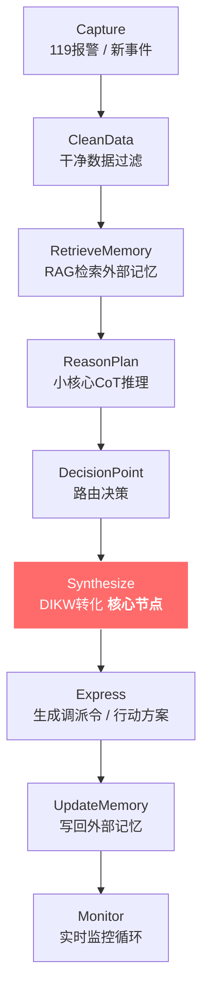

# DIKW_Framework（知识层级转化框架）

**最后更新**：2026-04-24
**标签**：#DIKW #知识管理 #数据信息知识智慧 #层级转化 #小认知核心

---

## 1. DIKW 是什么？（在我们系统中的定位）

DIKW 是我们第二大脑 + 消防调派引擎的核心**升维框架**，它把原始信息逐步转化为可行动的智慧：

| 层级 | 定义 | 在系统中的定位 |
|------|------|----------------|
| **Data（数据）** | 原始、碎片、无上下文的事实 | 报警记录、截图、日志 |
| **Information（信息）** | 结构化 + 上下文的数据 | 谁、何时、何地、什么情况 |
| **Knowledge（知识）** | 模式、因果、与历史连接后的洞见 | "为什么会这样" |
| **Wisdom（智慧）** | 可执行的决策、优先级、长期价值判断 | "现在该做什么？长期如何改进？" |

在**消防调派引擎**中，DIKW 不是静态笔记，而是**动态转化流程**，由**小认知核心**在 `Synthesize` 状态自动完成，最终驱动调派决策。

---

## 2. DIKW 转化完整流程（状态机版）

### 详细步骤（8步闭环）

| 步骤 | 状态机节点 | 具体操作（小认知核心执行） | 输出产物 | 耗时估算（AI辅助） |
|------|-----------|---------------------------|---------|-------------------|
| 1 | Capture | 接收原始输入（语音/短信/监控） | 原始Data | 0-5s |
| 2 | CleanData | 实体提取、去重、风险初筛、质量评分 | 干净Data | 3-12s |
| 3 | RetrieveMemory | 向量+图谱检索外部记忆（企业档案、历史案例） | 相关Information/Knowledge | 10-25s |
| 4 | ReasonPlan | CoT推理 + 模式匹配 | 初步洞见 | 15-35s |
| 5 | DecisionPoint | 输出**调派句JSON**（simple / escalate / tool_call） | 路由决策 | 5-10s |
| 6 | **Synthesize** | **DIKW逐层升维**（本流程核心） | Wisdom行动方案 | 15-60s |
| 7 | Express | 生成调派令、指挥屏内容、APP推送 | 可执行输出 | 10-30s |
| 8 | UpdateMemory | 结构化新Wisdom，写入知识图谱 + VectorTags | 更新外部记忆 | 处置后5-30min |

---

## 3. Synthesize 节点详解（最关键一步）

小认知核心在此节点执行**4层严格升维**：

### 3.1 Data → Information
- **动作**：组织结构、补充上下文、实体关联
- **产出**：结构化警情卡片（时间、地点、人物、事件）

### 3.2 Information → Knowledge
- **动作**：因果分析、历史模式匹配、风险链推导
- **产出**：洞见（如"该类火灾易引发蒸气云爆炸"）

### 3.3 Knowledge → Wisdom
- **动作**：优先级排序、行动方案、长期影响评估
- **产出**：**可立即执行的决策 + 预案升级建议**

### 3.4 Wisdom 闭环
- **动作**：生成调派句 + 更新外部记忆

---

## 4. 消防调派引擎中的DIKW转化模板（快速参考）

| DIKW层 | 内容模板 | 必须包含元素 |
|--------|---------|-------------|
| **Data** | 原始报警文字 | 时间、位置、关键词 |
| **Information** | 结构化警情 + 资源匹配 | 企业档案、历史数据 |
| **Knowledge** | 风险模式 + 因果链 | 与历史案例的连接 |
| **Wisdom** | 行动决策 + 优先级 + 长期预案升级建议 | 具体调派指令 + 更新外部记忆 |

详细示例见 `04_DIKW_Examples/` 中的三个文件：
- `01_Ordinary_Fire_DIKW.md` —— 普通火灾
- `02_Hazmat_Fire_DIKW.md` —— 危化火灾
- `03_Rescue_DIKW.md` —— 救援类

---

## 5. 操作 Checklist（小认知核心 & 人工双确认）

- [ ] 干净数据过滤是否完成？（无模糊、无重复）
- [ ] 是否检索外部记忆？（至少3条相关Knowledge）
- [ ] DIKW四层是否全部升维？（缺少Wisdom则拒绝输出）
- [ ] 调派句JSON是否结构化输出？
- [ ] 新Wisdom是否已写入 `05_ExternalMemory_Index`？
- [ ] 是否关联到对应MOC？

---

## 6. 与系统核心要素的集成

| 要素 | 集成说明 |
|------|----------|
| **干净数据** | 所有转化从第2步开始，必须经过CleanData |
| **小认知核心** | 永远在 `Synthesize` 节点完成升维（8B模型即可） |
| **外部记忆** | 提供历史Knowledge，转化后又被更新，形成飞轮 |
| **1800倍效率** | 99%普通场景只用小核心 + 检索，复杂场景才Escalate |

---

## 7. 相关链接

- [[PARA_System]]
- [[Workflow_StateMachine]]
- [[Wiki_Index]]
- [[FireDispatch_MOC_v2026-04]]
- [[01_Dispatch_Scale_Calculation_Model]]
- [[04_DIKW_Examples/_README]]
