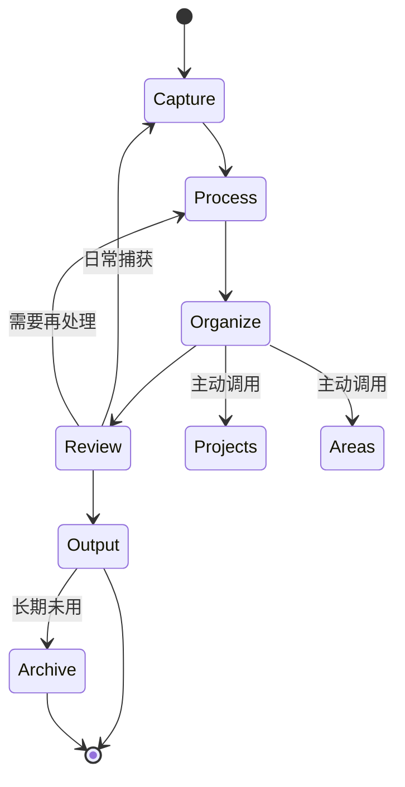

# Workflow_StateMachine（知识工作流状态机）

**最后更新**：2026-04-24
**标签**：#工作流 #状态机 #知识管理 #流程自动化

---

## 1. 概述

知识工作流状态机描述**知识从捕获到复用**的全流程：

```
Capture → Process → Organize → Review → Output → (Archive)
   ↓          ↓          ↓          ↓         ↓
 原始输入   初步处理   分类归位    复盘优化   输出应用   归档
```

---

## 2. 状态定义

### S0: Capture（捕获）
**将外部信息引入 Wiki**

| 入口 | 说明 |
|------|------|
| QuickCapture | 快速想法、灵感、一句话笔记 |
| ToProcess | 待处理内容（稍后细化） |
| 直接导入 | 外部文章、PDF、网页保存 |

**关键动作**：
- 标题命名
- 快速标签
- 来源记录

---

### S1: Process（处理）
**将原始内容转化为可用信息**

**关键动作**：
- 提取核心观点
- 添加个人注解
- 关联已有知识

**输出**：
- 结构化笔记
- 要点清单
- 疑问记录

---

### S2: Organize（组织）
**将处理后的内容归入 PARA**

| 目标位置 | 判断标准 |
|----------|----------|
| 01_Projects | 当前项目直接相关 |
| 02_Areas | 长期领域相关 |
| 03_Resources | 参考备用 |
| 04_Archives | 不再活跃 |

**关键动作**：
- 选择存放位置
- 创建双向链接
- 更新相关 MOC

---

### S3: Review（复盘）
**定期回顾，激活知识**

**频率建议**：
| 类型 | 频率 |
|------|------|
| 日回顾 | 5 分钟，处理 ToProcess |
| 周回顾 | 30 分钟，检视 Projects 进展 |
| 月回顾 | 1 小时，PARA 调整、归档 |

**关键动作**：
- 检查待办事项
- 激活沉睡知识
- 迭代优化

---

### S4: Output（输出）
**将知识转化为价值**

| 输出形式 | 示例 |
|----------|------|
| 写作 | 博客、文章、文档 |
| 分享 | 演讲、教学、讨论 |
| 应用 | 代码、设计、决策 |

**关键动作**：
- 写作输出
- 分享给他人
- 应用到项目

---

### S5: Archive（归档）
**知识退出活跃流转**

**判断标准**：
- 项目已完成
- 超过 3 个月未使用
- 已完全被新知识替代

---

## 3. 状态流转图



---

## 4. 各状态关键问题

| 状态 | 关键问题 |
|------|----------|
| **Capture** | 这值得保存吗？ |
| **Process** | 这讲的是什么？对我有什么用？ |
| **Organize** | 这应该放在哪里？ |
| **Review** | 我最近用过吗？还需要它吗？ |
| **Output** | 我能用什么形式输出？ |
| **Archive** | 还能用上吗？ |

---

## 5. 相关链接

- [[PARA_System]]
- [[DIKW_Framework]]
- [[Wiki_Index]]
- [[QuickCapture]]（待创建）
- [[ToProcess]]（待创建）
