# Mermaid_TimeAxis_Template（时间轴模板）

**最后更新**：2026-04-24
**标签**：#模板 #Mermaid #时间轴 #甘特图

---

## 模板说明

使用此模板绘制时间轴（Mermaid gantt chart）。

---

## 标准甘特图结构

```mermaid
gantt
    title {{标题}}
    dateFormat X
    axisFormat %s秒

    section {{阶段1}}
    任务1            :a1, 0, 30秒
    任务2            :a2, 30, 60秒

    section {{阶段2}}
    任务3            :a3, 60, 120秒
    任务4            :a4, 90, 150秒
```

---

## 消防调派出动时间轴示例

```mermaid
gantt
    title 消防调派出动时间轴
    dateFormat X
    axisFormat %M分钟

    section 接警阶段
    报警接入            :alarm, 0, 2分钟
    信息录入            :input, 1, 3分钟
    事件画像生成        :profile, 2, 4分钟

    section 计算阶段
    N_total计算         :calc, 3, 4分钟
    约束校验            :validate, 4, 5分钟
    方案生成            :plan, 5, 6分钟

    section 出动阶段
    调派出动            :dispatch, 6, 8分钟
    到场确认            :arrive, 8, 20分钟
    反馈归档            :feedback, 20, 25分钟
```

---

## 时间节点规范

| 阶段 | 最大时长 | 说明 |
|------|----------|------|
| 接警登记 | 2 分钟 | 快速录入 |
| 事件画像 | 2 分钟 | 自动生成 |
| N_total 计算 | 1 分钟 | 公式计算 |
| 约束校验 | 1 分钟 | 三层校验 |
| 调派方案 | 1 分钟 | 生成建议 |
| 出动反馈 | 2 分钟 | 确认归档 |

**目标总时长**：≤ 8 分钟（首波力量到场）

---

## 响应级别时间要求

| 级别 | 首波到场 | 增援到场 |
|------|----------|----------|
| 一级 | ≤ 8 分钟 | ≤ 15 分钟 |
| 二级 | ≤ 10 分钟 | ≤ 20 分钟 |
| 三级 | ≤ 15 分钟 | ≤ 30 分钟 |
| 四级 | ≤ 20 分钟 | ≤ 40 分钟 |
| 五级 | ≤ 30 分钟 | ≥ 40 分钟 |

---

## 相关链接

- [[TimeAxis]]
- [[警情定级映射规则]]
- [[调派引擎实现细节]]
