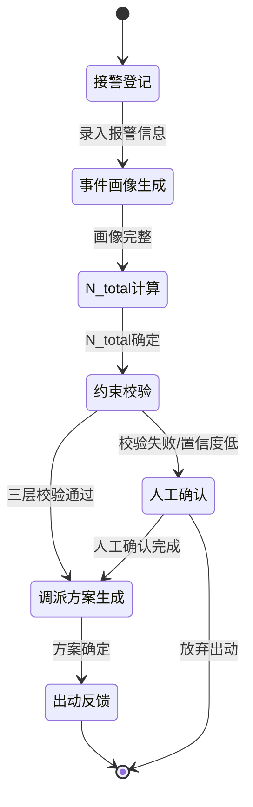

# StateMachine_Template（状态机模板）

**最后更新**：2026-04-24
**标签**：#模板 #状态机 #Mermaid #流程图

---

## 模板说明

使用此模板绘制状态机图（Mermaid stateDiagram）。

---

## 标准状态机结构

```mermaid
stateDiagram-v2
    [*] --> {{Initial_State}}

    {{Initial_State}} --> {{State_1}}: 条件/事件
    {{State_1}} --> {{State_2}}: 条件/事件
    {{State_2}} --> {{State_3}}: 条件/事件
    {{State_3}} --> [*]

    {{State_1}} --> {{Error_State}}: 异常/失败
    {{State_2}} --> {{Error_State}}: 异常/失败
```

---

## 消防调派引擎状态机示例



---

## 状态命名规范

| 阶段 | 状态名称 | 说明 |
|------|----------|------|
| 0 | 接警登记 | 接收报警 |
| 1 | 事件画像生成 | 构建事件画像 |
| 2 | N_total计算 | 计算总力量 |
| 3 | 约束校验 | 三层约束检查 |
| 4 | 调派方案生成 | 生成方案 |
| 5 | 人工确认 | 等待人工确认 |
| 6 | 出动反馈 | 最终反馈 |

---

## 相关链接

- [[09_数据流转与状态机]]
- [[Workflow_StateMachine]]
- [[消防多智能体架构]]
