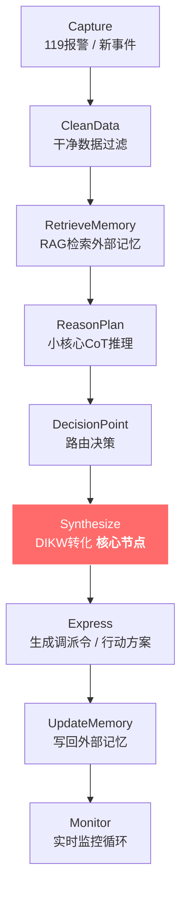

# DIKW_MOC_v2026-04（知识管理方法论）

**最后更新**：2026-04-24
**标签**：#MOC #知识管理 #DIKW #PARA #第二大脑
**页面作用**：02_Areas/KnowledgeManagement 的**总导航页**

---

## 快速入口

- [[DIKW_Framework]] —— 完整 DIKW 转化流程（8步闭环 + Synthesize 节点）
- [[PARA_System]] —— Projects/Areas/Resources/Archives 组织法
- [[Workflow_StateMachine]] —— 知识工作流状态机

---

## 核心概念

| 概念 | 说明 |
|------|------|
| **小认知核心** | 负责接收报警信息，提取关键槽位，在 `Synthesize` 节点完成 DIKW 升维 |
| **外部记忆** | 向量检索标签 + 知识图谱索引，供 RAG 调用 |
| **DIKW 转化** | Data→Information→Knowledge→Wisdom 的动态流程 |

---

## 最新更新

- 2026-04-24：增加 DIKW 8步闭环状态机流程
- 2026-04-24：增加 Synthesize 节点详解（核心升维步骤）
- 2026-04-24：增加操作 Checklist（小认知核心 & 人工双确认）

---

## DIKW 转化流程（8步闭环）

| 步骤 | 节点 | 输出 | 耗时 |
|------|------|------|------|
| 1 | Capture | 原始Data | 0-5s |
| 2 | CleanData | 干净Data | 3-12s |
| 3 | RetrieveMemory | Information/Knowledge | 10-25s |
| 4 | ReasonPlan | 初步洞见 | 15-35s |
| 5 | DecisionPoint | 路由决策 | 5-10s |
| 6 | **Synthesize** | **Wisdom行动方案** | 15-60s |
| 7 | Express | 可执行输出 | 10-30s |
| 8 | UpdateMemory | 更新外部记忆 | 处置后 |

---

## 操作 Checklist

- [ ] 干净数据过滤是否完成？（无模糊、无重复）
- [ ] 是否检索外部记忆？（至少3条相关Knowledge）
- [ ] DIKW四层是否全部升维？（缺少Wisdom则拒绝输出）
- [ ] 调派句JSON是否结构化输出？
- [ ] 新Wisdom是否已写入 `05_ExternalMemory_Index`？
- [ ] 是否关联到对应MOC？

---

## 子模块导航

### 1. PARA_System
个人知识组织系统，按活跃度分为：
- **Projects**：当前进行中的项目
- **Areas**：长期维护的领域
- **Resources**：参考资料库
- **Archives**：已归档内容

### 2. DIKW_Framework
知识层级转化框架，包含：
- **Data（数据）**：原始事实
- **Information（信息）**：处理过的数据
- **Knowledge（知识）**：可应用的信息
- **Wisdom（智慧）**：判断与决策能力
- **8步闭环状态机**
- **Synthesize 节点详解**

### 3. Workflow_StateMachine
知识工作流状态机：
- **Capture** → **Process** → **Organize** → **Review** → **Output** → **Archive**

---

## 相关链接

- [[Wiki_Index]]
- [[FireDispatch_MOC_v2026-04]]
- [[Agent_Dispatch_MOC_v2026-04]]
- [[04_DIKW_Examples/_README]]
