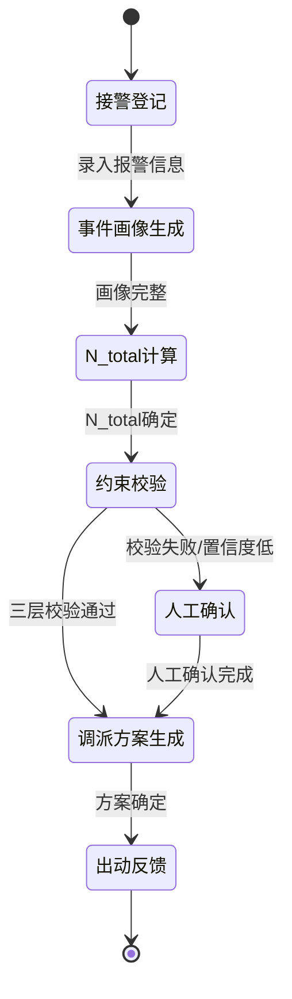

# FireDispatch_MOC_v2026-04 - 消防调派引擎总导航

**最后更新**：2026-04-24
**标签**：#MOC #消防调派引擎 #接处警7.0 #知识枢纽

---

## 快速入口

- [[01_Requirements/_README]] —— 需求与规则
- [[04_DIKW_Examples/_README]] —— DIKW 示例
- [[06_DispatchEngine/_README]] —— 调派引擎核心
- [[07_TimeAxis_Roadmap/Roadmap]] —— 开发路线图

---

## 核心概念

- **小认知核心**：负责接收报警信息，提取关键槽位
- **外部记忆**：向量检索标签 + 知识图谱索引
- **DIKW 转化流程**：Data → Information → Knowledge → Wisdom
- **普通 / 危化 / 救援 三类场景对比**

---

## 最新更新

- 2026-04-24：完成目录结构优化，01-09 序号命名
- 2026-04-24：新增 DIKW 三场景模板（普通/危化/救援）
- 2026-04-24：MOC 文件加版本号 _v2026-04

---

## 模块导航

| 子模块 | 说明 | 入口 |
|--------|------|------|
| 01_Requirements | 子场景画像、N_total公式 | [[01_Requirements/_README]] |
| 02_Scenarios | 全链路场景模拟 | [[02_Scenarios/_README]] |
| 03_SystemDesign | 系统设计、状态机 | [[03_SystemDesign/_README]] |
| 04_DIKW_Examples | DIKW 示例 | [[04_DIKW_Examples/_README]] |
| 05_DataModel | 数据模型 | [[05_DataModel/_README]] |
| 06_DispatchEngine | 调派引擎核心 | [[06_DispatchEngine/_README]] |
| 07_TimeAxis_Roadmap | 时间轴 + Roadmap | [[07_TimeAxis_Roadmap/_README]] |
| 08_Simulation_Data | 审计、模拟数据 | [[08_Simulation_Data/_README]] |
| 09_Appendix | 公式汇总 | [[09_Appendix/_README]] |

---

## 三大场景快速入口

| 场景类型 | 代表场景 | N_total 范围 | 编成特点 |
|----------|----------|--------------|----------|
| **普通火灾** | 城中村、普通住宅 | 4-8 | 常规编成，快速响应 |
| **危化火灾** | 化工园区、锂电池 | 10-20 | 特殊装备，防毒防爆 |
| **救援类** | 洪水、高空、塌陷 | 6-12 | 救援装备，分层梯次 |

---

## 状态机总览



**目标**：首波力量 ≤ 8 分钟到场

---

## N_total 公式

```
N_total = N_base + α_sub + β_struct + G_special + M_support + Δ_confidence + Δ_scene
```

---

## 相关链接

- [[Wiki_Index]]
- [[DIKW_MOC_v2026-04]]
- [[Agent_Dispatch_MOC_v2026-04]]
