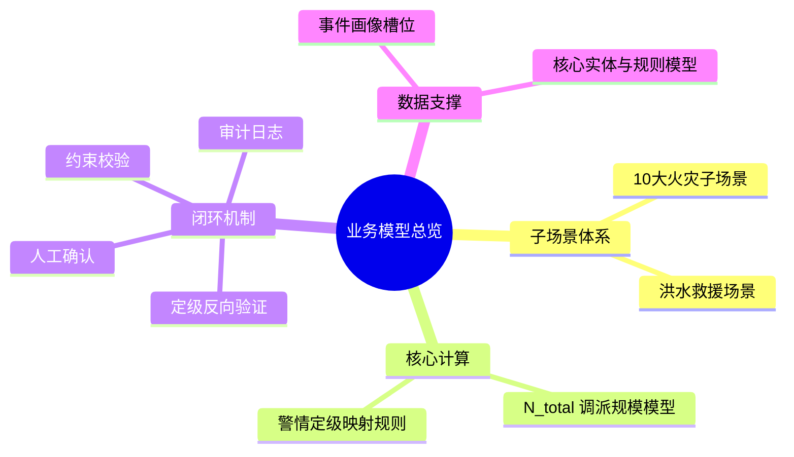

# MOC-业务模型

**最后更新**：2026-04-24
**标签**：#MOC #业务模型 #核心导航 #数据定力 #调派引擎
**页面作用**：**02_业务模型** 文件夹的**单一入口**和**总导航页**

## 英雄区 · 一键快速入口

> **[!important] 接警 / 指挥最常用**
> - [[火灾子场景分类]] —— 快速匹配子场景
> - [[所有子场景推荐编成统一对照表]] —— 直接看该派什么力量
> - [[子场景画像/]] —— 查看完整画像与计算过程

> **[!note] 产品 / 开发最常用**
> - [[调派规模计算模型]] —— 公式与配置详解
> - [[03_调派引擎/警情定级映射规则]] —— N_total 如何转等级
> - [[03_调派引擎/定级反向验证逻辑详解]] —— 闭环机制核心

---

## 业务模型总览

**02_业务模型** 是整个接处警 7.0 系统的**业务核心**，包含警情画像、子场景分类、调派规模计算、定级规则、闭环验证等关键内容。

**核心目标**：
- 支撑从模糊报警到结构化力量编成的精准转化
- 实现"按出动力度定级 + 数据定力"的闭环设计
- 覆盖 95%+ 日常火警 + 常见应急救援场景

---

## 模型全景思维导图

---

## 核心内容导航（按角色分组）

### 接警员 / 指挥员专区
- [[火灾子场景分类]]
- [[所有子场景推荐编成统一对照表]]
- [[子场景画像/]]（完整画像模板）
- [[10大子场景详细计算示例]]

### 产品 / 开发专区
- [[调派规模计算模型]]（公式 + 配置）
- [[03_调派引擎/警情定级映射规则]]
- [[03_调派引擎/定级反向验证逻辑详解]]
- [[03_调派引擎/约束校验实现细节]]
- [[03_调派引擎/05_人工确认与责任机制]]

### 模型 MOC 专区
- [[MOC-调派规模计算模型]]（N_total 专用中心页）

### 数据模型支撑
- [[04_数据模型/01_核心实体与领域模型]]
- [[04_数据模型/05_调派规则模型]]

---

## 11大子场景速查

| 子场景 | N_total | 等级 | 首波主力 | 保障 |
|--------|---------|------|----------|------|
| 普通住宅 | 2-4 | 一级 | 2水罐 | - |
| 高层住宅 | 8-12 | 三级 | 3水罐+3登高 | 细水雾+抢险 |
| 地下车库 | 7-10 | 二~三级 | 2排烟+2水罐 | 破拆+抢险 |
| 商业综合体 | 9-13 | 三级 | 4水罐 | 2搜救+2医疗 |
| 工业厂房 | 8-14 | 三~四级 | 3水罐 | 2破拆+2供水 |
| 化工园区 | 13-20 | 四级 | 4抗溶+3供水 | 2防化+2洗消 |
| 锂电池仓库 | 10-15 | 三~四级 | 4细水雾+2机器人 | 3供水 |
| 电动车 | 4-8 | 二级 | 2细水雾+1水罐 | 1抢险 |
| 人员密集 | 10-16 | 三~四级 | 4水罐 | 3搜救+2医疗 |
| 物流/冷库 | 9-14 | 三级 | 3水罐 | 2排烟+1破拆 |
| **洪水救援** | 6-12 | 二~四级 | 4冲锋舟+2水上 | 1医疗保障 |

> 完整表格：[[所有子场景推荐编成统一对照表]]

---

## 使用指南

- **接警员**：匹配子场景 → 跳转画像 → 确认槽位 → 自动生成方案
- **指挥员**：直接查看速查表，快速决定首波力量
- **产品/开发**：从公式和规则配置开始，完成后台维护
- **新人**：从本 MOC 开始，5 分钟掌握整个业务模型

---

## 相关链接

- [[03_调派引擎/01_概述与核心目标]]
- [[03_调派引擎/MOC-调派引擎]]
- [[04_数据模型/MOC-数据模型]]

## 变更记录

- 2026-04-24：优化导航版，英雄区一键入口、角色分组、思维导图
- 2026-04-24：整合11大子场景（含洪水救援）