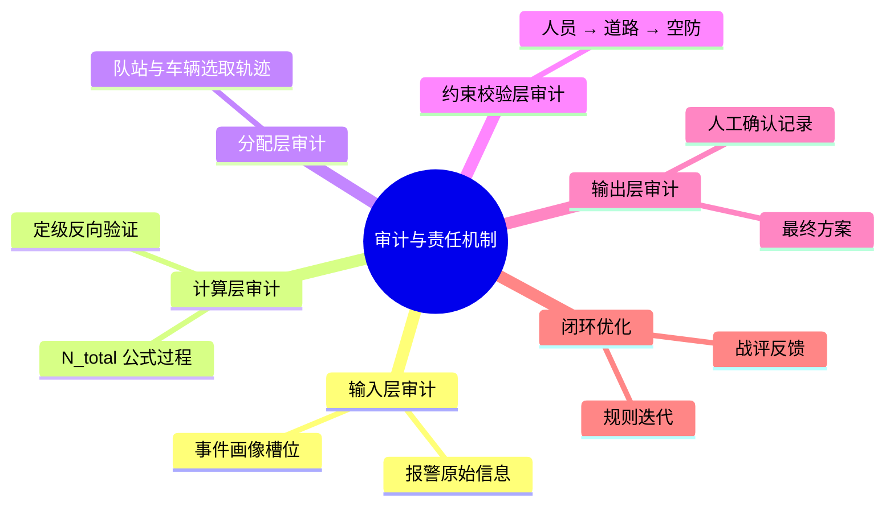

# MOC-审计与责任机制

**最后更新**：2026-04-24
**标签**：#MOC #审计机制 #责任追溯 #全链路审计 #不可篡改日志
**页面作用**：**05_审计与责任机制** 文件夹的**单一入口**和**总导航页**

## 英雄区 · 一键快速入口

> **[!important] 审计 / 合规最常用**
> - [[06_审计机制与报告模板]] —— 单警情 & 周期报告模板
> - [[07_审计日志表结构]] —— 审计日志完整表结构

> **[!note] 责任与人工确认相关**
> - [[03_调派引擎/05_人工确认与责任机制]] —— 确认节点 & 责任归属
> - [[03_调派引擎/定级反向验证逻辑详解]] —— 反向验证审计点

---

## 审计与责任机制总览

**05_审计与责任机制** 是调派引擎的**事后闭环与合规核心**，实现全过程可追溯、可复盘、可问责。

**核心目标**：
- 全链路覆盖（画像 → 计算 → 分配 → 约束 → 确认 → 反馈）
- 90% 以上内容系统自动生成
- 日志不可篡改 + 一键生成审计报告
- 满足 GB 16281-2024、《消防救援队伍接处警工作规范》等要求

---

## 审计全链路思维导图

---

## 核心内容导航（按功能分组）

### 1. 审计机制核心
- [[06_审计机制与报告模板]] —— 全链路审计分类 + 单警情报告模板
- [[07_审计日志表结构]] —— AuditLog 完整表结构与哈希链

### 2. 责任与人工确认
- [[03_调派引擎/05_人工确认与责任机制]] —— 必须人工确认的节点 + 确认中心设计
- [[03_调派引擎/定级反向验证逻辑详解]] —— 反向验证审计点

### 3. 配套机制
- [[03_调派引擎/约束校验实现细节]] —— 约束失败审计记录
- [[调派系统审计]] —— 系统审计总览
- [[调派责任机制与人工确认节点]] —— 责任机制与确认节点

---

## 使用指南

- **审计/合规人员**：直接使用报告模板生成单警情或周期审计报告
- **指挥员/接警员**：查看人工确认节点和责任记录
- **开发工程师**：参考审计日志表结构和全链路记录字段
- **产品经理**：从本 MOC 快速了解审计闭环设计
- **新人**：从本 MOC 开始，10 分钟掌握审计与责任全貌

---

## 相关链接

- [[03_调派引擎/01_概述与核心目标]]
- [[02_业务模型/MOC-业务模型]]
- [[04_数据模型/MOC-数据模型]]
- [[03_调派引擎/MOC-调派引擎]]

## 变更记录

- 2026-04-24：优化导航版，英雄区一键入口、角色分组、思维导图