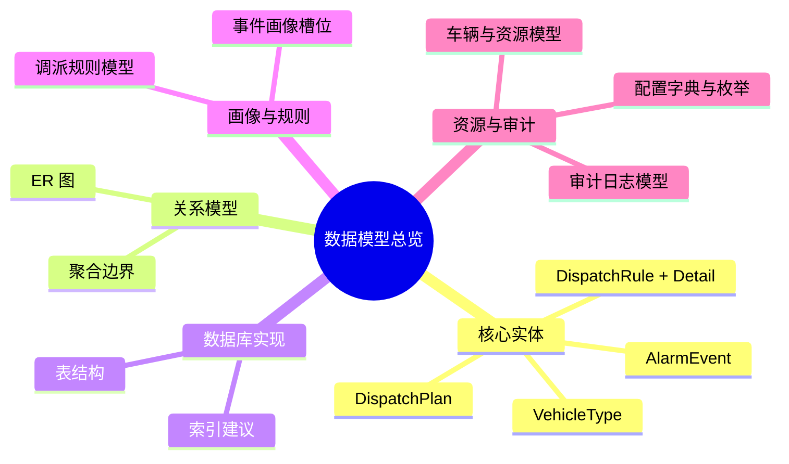

# MOC-数据模型

**最后更新**：2026-04-24
**标签**：#MOC #数据模型 #核心实体 #ER图 #数据库表 #调派规则
**页面作用**：**04_数据模型** 文件夹的**单一入口**和**总导航页**

## 英雄区 · 一键快速入口

> **[!important] 开发 / 产品最常用**
> - [[01_核心实体与领域模型]] —— 核心实体清单
> - [[02_ER图与关系模型]] —— 完整实体关系图
> - [[03_数据库表结构]] —— SQL 表结构与索引

> **[!note] 规则与画像相关**
> - [[04_事件画像槽位定义]] —— 画像槽位全表
> - [[05_调派规则模型]] —— DispatchRule + Detail
> - [[06_车辆与资源模型]] —— VehicleType + 库存

---

## 数据模型总览

**04_数据模型** 是调派引擎和整个接处警 7.0 系统的**数据基石**，定义了从事件画像到出动方案、审计日志的所有核心实体、关系、表结构和配置字典。

**核心目标**：
- 支撑 N_total 计算、规则引擎、约束校验、审计追溯
- 实现数据驱动 + 可配置 + 可审计
- 为开发提供清晰的 ER 图、表结构和 JSON 配置参考

---

## 数据模型全景思维导图

---

## 核心内容导航（按功能分组）

### 1. 实体与关系层
- [[01_核心实体与领域模型]] —— DDD 实体清单与职责
- [[02_ER图与关系模型]] —— 完整 Mermaid ER 图

### 2. 数据库实现层
- [[03_数据库表结构]] —— 所有核心表的 SQL DDL

### 3. 画像与规则层
- [[04_事件画像槽位定义]] —— 槽位全表 + 对 N_total 的影响
- [[05_调派规则模型]] —— DispatchRule + Detail + JSON conditions

### 4. 资源与审计层
- [[06_车辆与资源模型]] —— VehicleType + FireStationVehicle
- [[07_审计日志与责任模型]] —— AuditLog 表结构
- [[08_配置字典与枚举]] —— 等级、车辆功能、物质类型等字典
- [[09_数据流转与状态机]] —— 警情全生命周期状态机

---

## 使用指南

- **开发工程师**：从 ER 图 → 表结构 → 规则模型开始实现
- **产品经理**：重点看画像槽位和规则模型，定义业务逻辑
- **架构师**：查看实体关系和状态机，设计聚合边界
- **新人**：从本 MOC 开始，10 分钟掌握数据模型全貌

---

## 相关链接

- [[02_业务模型/MOC-业务模型]]
- [[03_调派引擎/01_概述与核心目标]]
- [[03_调派引擎/MOC-调派引擎]]

## 变更记录

- 2026-04-24：优化导航版，英雄区一键入口、角色分组、思维导图