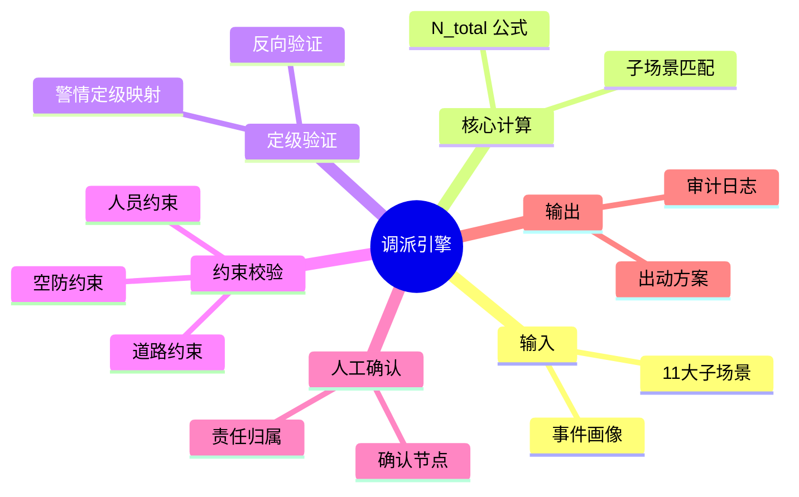

# MOC-调派引擎

**最后更新**：2026-04-24
**标签**：#MOC #调派引擎 #核心导航 #数据定力 #闭环治理
**页面作用**：**03_调派引擎** 文件夹的**单一入口**和**总导航页**

## 英雄区 · 一键快速入口

> **[!important] 接警/指挥最常用**
> - [[02_业务模型/火灾子场景分类]] —— 快速匹配子场景
> - [[02_业务模型/所有子场景推荐编成统一对照表]] —— 直接看该派什么力量

> **[!note] 产品/开发最常用**
> - [[调派规模计算模型]] —— N_total 公式详解
> - [[警情定级映射规则]] —— N_total 如何转等级
> - [[定级反向验证逻辑详解]] —— 闭环机制核心

---

## 调派引擎总览

**调派引擎**是接处警 7.0 系统的**核心指挥大脑**，负责从事件画像到出动方案的全流程闭环。

**核心目标**：
- 精准匹配战术需求（N_total 准确率 ≥ 95%）
- 实战可行性保障（实际到场率 ≥ 95%）
- 数据定力闭环（反向验证通过率 ≥ 98%）
- 责任清晰可追溯（人工确认覆盖率 100%）

---

## 调派引擎全景思维导图

---

## 核心内容导航

### 1. 基础概述
- [[01_概述与核心目标]] —— 模块定位与设计纲领

### 2. 核心计算（详见 [[02_业务模型/MOC-调派规模计算模型]]）
- [[02_业务模型/调派规模计算模型]] —— N_total 扩展公式
- [[02_业务模型/火灾子场景分类]] —— 11大子场景总览
- [[02_业务模型/所有子场景推荐编成统一对照表]] —— 速查表

### 3. 定级与验证
- [[警情定级映射规则]]
- [[定级反向验证逻辑详解]]

### 4. 约束校验
- [[04_约束校验机制]]
- [[约束校验实现细节]]

### 5. 人工确认
- [[05_人工确认与责任机制]]

### 6. 审计与复盘
- [[06_审计机制与报告模板]]

### 7. 数学模型
- [[07_数学模型全链路]]

### 8. 实战示例
- [[08_典型场景示例]]
- [[09_优化建议与审计发现]]

---

## 使用指南

- **接警员**：匹配子场景 → N_total → 推荐编成
- **指挥员**：查看速查表 → 快速决策
- **开发/产品**：公式 → 规则配置 → 约束校验 → 审计追溯
- **新人**：从本 MOC 开始，10 分钟掌握调派引擎全貌

---

## 相关链接

- [[02_业务模型/MOC-业务模型]]
- [[04_数据模型/MOC-数据模型]]
- [[05_审计与责任机制/MOC-审计与责任机制]]

## 变更记录

- 2026-04-24：创建 MOC-调派引擎，整合全部调派引擎文档